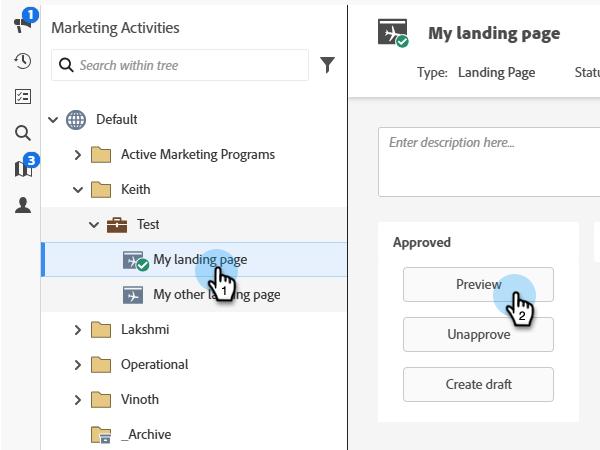

# ランディングページをプレビューする {#preview-a-landing-page}

本番稼働前に、ランディングページをプレビューして確認しましょう。

>[!IMPORTANT]
>
>一部のカスタムメタタグは、Marketo Engageのセキュリティを維持するために設定されたコンテンツセキュリティポリシーに違反する可能性があるため、プレビューモード（`<meta http-equiv="refresh" ...>` リダイレクトディレクティブなど）ではサポートされていません。 これらのタグを含むランディングページは、プレビューURL （**プレビューアクション** > **プレビューURLを生成**）を生成し、新しいブラウザーウィンドウにペーストすることでプレビューできます。

## 承認済みページのプレビュー {#preview-approved-page}

1. 目的のランディングページを選択し、**[!UICONTROL プレビュー]**&#x200B;をクリックします。

   

ランディングページを右クリックして、「**[!UICONTROL プレビュー]**」を選択することもできます。

## ドラフトのプレビュー {#preview-a-draft}

1. 目的のランディングページを選択し、**[!UICONTROL 下書きをプレビュー]**&#x200B;をクリックします。

   

>[!NOTE]
>
>ドラフトは作業中のバージョンであり、お客様に表示されるライブバージョンではありません。

## 編集中にランディングページのドラフトをプレビューする {#preview-a-draft-while-editing}

1. 目的のランディングページを選択し、**[!UICONTROL ドラフトを編集]**&#x200B;をクリックします。

   

1. ランディングページエディターで、**[!UICONTROL 下書きをプレビュー]**&#x200B;をクリックします。

   

1. **[!UICONTROL ドラフトを編集]**&#x200B;をクリックして編集に戻ります。

   
