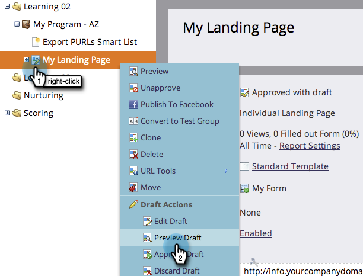

# ランディングページのプレビュー {#preview-a-landing-page}

ランディングページを実稼動させる前に、その画像がどのように見えるかを確認したいと思うかもしれません。

## ランディングページのプレビュー {#preview-a-landing-page-1}

1. ランディングページを選択し、「 **プレビュー****ページ**」をクリックします。

   

   >[!NOTE]
   >
   >下書きとは、作業中のバージョンで、実際の顧客には表示されません。

1. ランディングページを右クリックして「 **プレビュー**」を選択することもできます。

   

## ランディングページドラフトのプレビュー {#preview-a-landing-page-draft}

1. ドラフトバージョンを持つ承認済みランディングページを右クリックし、「 **プレビュー****ドラフト**」をクリックします。

   

## 編集中のランディングページドラフトのプレビュー {#preview-a-landing-page-draft-while-editing}

1. ランディングページを選択し、「 **編集****」「**&#x200B;ドラフト」をクリックします。

   

1. ランディングページエディターでの作業中の任意の時点で、「 **プレビュードラフト」をクリックできます。**

   

1. 「ドラフトを **編集」をクリックすると、すばやく編集に戻ることができます。**

   

お疲れさま！ これで、ランディングページのプレビュー方法が分かります。
