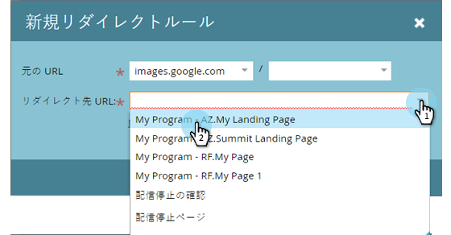
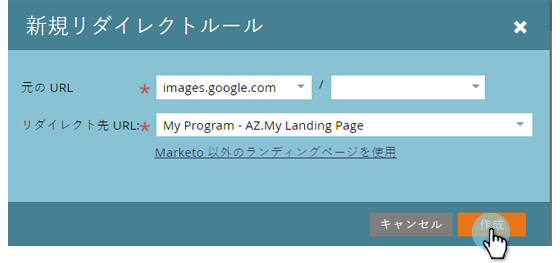

# マーケティング先ランディングページを別のページにリダイレクト {#redirect-a-marketo-landing-page-to-another-page}

ページのURLを更新した後で、古いURLを引き続き使用したい場合は、リダイレクトを試してみてください。 設定は簡単です。

>[!NOTE]
>
>**必要な管理者権限**

1. 「 **管理者**」の下にある「 **ランディング****ページ**」をクリックします。

   

1. 「 **ルール** 」タブで、「 **新規** 」をクリックし、「 **新規リダイレクト」をクリックします。次に、「新規リダイレクト」をクリックします。**********&#x200B;次に、「新規リダイレクト」をクリックします。

   

1. **最初の** 「 **元の** URL **」ドロップダウンをクリックし、Marketo CNAME**CNAMEを選択します。

   

   >[!NOTE]
   >
   >**Reminder**
   >
   >
   >リダイレクトできるのは、Marketo CNAMEとの開始に関するURLだけで [す](customize-your-landing-page-urls-with-a-cname.md)。

1. リダイレクトするランディングページを、 **2番目の「元のURL** 」フィールドで選択します。

   

   >[!NOTE]
   >
   >ページまたはディレクトリが存在しない場合でも、任意のURLパスを入力できます。

1. 「 **リダイレクト** URL **** 」ドロップダウンをクリックし、訪問者のリダイレクト先のページを選択します。

   

1. 「 **作成**」をクリックします。

   

   >[!TIP]
   >
   >Marketor以外のWebページにリダイレクトするには、「 **Use non-Markettorランディングページ**」をクリックします。

   >[!NOTE]
   >
   >**関連記事**
   >
   >    
   >    
   >    * [URLパスのリダイレクト](../../../../product-docs/demand-generation/landing-pages/personalizing-landing-pages/redirect-a-url-path.md)

足を蹴れ、マーケティング・ヒーロー、終わった！