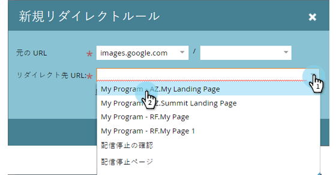
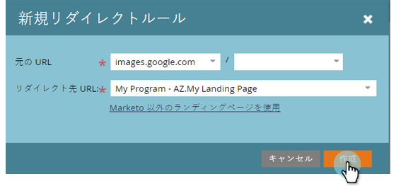

# Marketo のランディングページを別のページにリダイレクトする {#redirect-a-marketo-landing-page-to-another-page}

ページの URL をアップデートした後で古い URL を引き続き機能させたい場合は、リダイレクトを試してください。設定は簡単です。

>[!NOTE]
>
>**管理者権限が必要**

1. 「**[!UICONTROL 管理者]**」で「**[!UICONTROL ランディングページ]**」をクリックします。

   

1. 「**[!UICONTROL ルール]**」タブで、**[!UICONTROL 新規]**／**[!UICONTROL 新規リダイレクトルール]**&#x200B;をクリックします。

   

1. 最初の&#x200B;**[!UICONTROL オリジナル URL]** ドロップダウンをクリックして、自分の [Marketo CNAME](/help/marketo/product-docs/demand-generation/landing-pages/landing-page-actions/customize-your-landing-page-urls-with-a-cname.md) を選択します。

   

   >[!NOTE]
   >
   >自分の Marketo [CNAME](/help/marketo/product-docs/demand-generation/landing-pages/landing-page-actions/customize-your-landing-page-urls-with-a-cname.md) で始まる URL のみをリダイレクトできます。

1. 2 番目の「**[!UICONTROL オリジナル URL]**」フィールドに、リダイレクトするランディングページを入力します。

   

   >[!NOTE]
   >
   >ページやディレクトリが存在しない場合でも、任意の URL パスを入力できます。

1. **[!UICONTROL リダイレクト URL]** ドロップダウンをクリックして、訪問者をリダイレクトするページを選択します。

   

1. 「**[!UICONTROL 作成]**」をクリックします。

   

   >[!TIP]
   >
   >Marketo 以外の Web ページにリダイレクトするには、「**[!UICONTROL Marketo 以外のランディングページを使用]**」をクリックします。

   >[!MORELIKETHIS]
   >
   >[URL パスのリダイレクト](/help/marketo/product-docs/demand-generation/landing-pages/personalizing-landing-pages/redirect-a-url-path.md)
