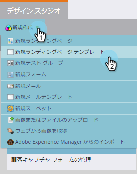

# フリーフォームランディングページテンプレートを作成する {#create-a-free-form-landing-page-template}

フリーフォームのランディングページに必要な技術知識は、ガイド付きのランディングページに必要な技術知識よりも少なくなります。今後のランディングページで使用されるテンプレートを作成するには、次の手順に従います。

1. 「**Design Studio**」に移動します。

   

1. 「**新規作成**」をクリックして、「**新規ランディングページテンプレート**」を選択します。

   

1. フォルダーを選択し、テンプレートに名前を付けます。フリーフォームはデフォルトの編集モードなので、テンプレートに名前を付けた後で「**作成**」をクリックします。

   

1. テンプレートが新しいタブで開きます。これで、CSS／HTML に詳しいユーザーは誰でもテンプレートを編集できるようになります。

   

   >[!NOTE]
   >
   >Marketo サポートは、カスタム HTML のトラブルシューティングについては対応できません。HTML のサポートについては、Web 開発者にご相談ください。

1. 編集が完了したら、「**テンプレートアクション**」をクリックし、「**承認して閉じる**」を選択します。

   

   これで、新しいフリーフォームランディングページテンプレートができました。

   >[!NOTE]
   >
   >フォームが事前入力されないようにしたい場合、または特定のページで Web の動作を追跡したくない場合は、「**Munchkin トラッキングの無効化**」を選択します。\
   >「**モバイルの互換性を検証**」を選択して、コードがモバイルデバイスと互換性があることを確認します。

   >[!MORELIKETHIS]
   >
   >* [フリーフォームランディングページを作成する](/help/marketo/product-docs/demand-generation/landing-pages/free-form-landing-pages/create-a-free-form-landing-page.md)
   >* [ガイド付きランディングページテンプレートを作成する](/help/marketo/product-docs/demand-generation/landing-pages/landing-page-templates/create-a-guided-landing-page-template.md)
   >* [フリーフォームとガイド付きのランディングページについて](/help/marketo/product-docs/demand-generation/landing-pages/understanding-landing-pages/understanding-free-form-vs-guided-landing-pages.md)

