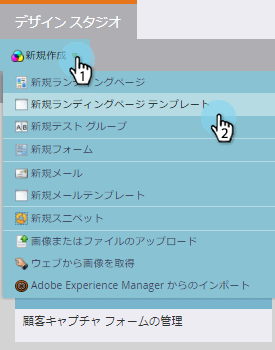

# フリーフォームランディングページテンプレートを作成する {#create-a-free-form-landing-page-template}

フリーフォームのランディングページに必要な技術知識は、ガイド付きのランディングページに必要な技術知識よりも少なくなります。 今後のランディングページで使用されるテンプレートを作成するには、次の手順に従います。

1. 「**[!UICONTROL Design Studio]**」に移動します。

   

1. 「**[!UICONTROL 新規作成]**」をクリックして、「**[!UICONTROL 新規ランディングページテンプレート]**」を選択します。

   

1. フォルダーを選択し、テンプレートに名前を付けます。 フリーフォームはデフォルトの編集モードなので、テンプレートに名前を付けた後で「**[!UICONTROL 作成]**」をクリックします。

   

1. テンプレートが新しいタブで開きます。 CSS/HTMLに精通している人なら誰でも編集できるようになりました。

   

   >[!NOTE]
   >
   >Marketo サポートは、カスタム HTML のトラブルシューティングについては対応できません。 HTML のサポートについては、web 開発者にご相談ください。

1. 編集が完了したら、**[!UICONTROL テンプレートアクション]**&#x200B;をクリックし、**[!UICONTROL 承認して閉じる]**&#x200B;を選択します。

   

   >[!NOTE]
   >
   >フォームが事前入力されないようにしたい場合、または特定のページで Web の動作を追跡したくない場合は、「**[!UICONTROL Munchkin トラッキングの無効化]**」を選択します。
   >「**[!UICONTROL モバイルの互換性を検証]**」を選択して、コードがモバイルデバイスと互換性があることを確認します。

   >[!MORELIKETHIS]
   >
   >* [フリーフォームランディングページの作成](/help/marketo/product-docs/demand-generation/landing-pages/free-form-landing-pages/create-a-free-form-landing-page.md)
   >* [ガイド付きランディングページテンプレートの作成](/help/marketo/product-docs/demand-generation/landing-pages/landing-page-templates/create-a-guided-landing-page-template.md)
   >* [フリーフォームとガイド付きのランディングページについて](/help/marketo/product-docs/demand-generation/landing-pages/understanding-landing-pages/understanding-free-form-vs-guided-landing-pages.md)
