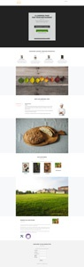

# ガイド付きランディングページテンプレートリスト {#guided-landing-page-template-list}

[ガイド付きランディングページエディター](/help/marketo/product-docs/demand-generation/landing-pages/guided-landing-pages/create-a-guided-landing-page.md)で使用するサンプルテンプレートのコレクションを参照します。各テンプレートは完全にレスポンシブで、Bootstrap フレームワークに基づいています。

>[!NOTE]
>
>Marketo サポートは、HTML のトラブルシューティングについては対応できません。これらのテンプレートの変更について不明な点がある場合は、Web デベロッパーにお問い合わせください。

テンプレートを Marketo にインポートするには：

1. より大きく表示するには、テンプレートの名前をクリックします。
1. 選択したテンプレートをダウンロードします。
1. Marketo で、**Design Studio** に移動します。
1. 左側のツリーで、「**ランディングページ**」をクリックして、「**テンプレート**」を選択します。

1. メニューバーで、「**テンプレートをインポート**」をクリックします。
1. ダウンロードしたファイルを選択し、テンプレート名を入力して、「**インポート**」をクリックします（わかりやすい名前を必ず選択し、編集モードが&#x200B;**ガイド付き**&#x200B;であることを示します)。

|  |  |  |
|---|---|---|
| [テンプレート 1A](guided-landing-page-templates/template-1a.md) | [テンプレート 1B](guided-landing-page-templates/template-1b.md) | [テンプレート 1C](guided-landing-page-templates/template-1c.md) |
|  |  |  |
| [テンプレート 1D](guided-landing-page-templates/template-1d.md) | [テンプレート 1E](guided-landing-page-templates/template-1e.md) | [テンプレート 1F](guided-landing-page-templates/template-1f.md) |
|  |  |  |
| [テンプレート 2A](guided-landing-page-templates/template-2a.md) | [テンプレート 2B](guided-landing-page-templates/template-2b.md) | [テンプレート 2C](guided-landing-page-templates/template-2c.md) |
|  |  |  |
| [テンプレート 2D](guided-landing-page-templates/template-2d.md) | [テンプレート 3A](guided-landing-page-templates/template-3a.md) | [テンプレート 3B](guided-landing-page-templates/template-3b.md) |
|  |  |  |
| [テンプレート 3C](guided-landing-page-templates/template-3c.md) | [テンプレート 3D](guided-landing-page-templates/template-3d.md) | [テンプレート 4A](guided-landing-page-templates/template-4a.md) |
|  |  |  |
| [テンプレート 4B](guided-landing-page-templates/template-4b.md) | [テンプレート 4C](guided-landing-page-templates/template-4c.md) | [テンプレート 5A](guided-landing-page-templates/template-5a.md) |
|  |  |  |
| [テンプレート 5B](guided-landing-page-templates/template-5b.md) | [テンプレート 5C](guided-landing-page-templates/template-5c.md) | [テンプレート 5D](guided-landing-page-templates/template-5d.md) |
|  |  |  |
| [テンプレート 5E](guided-landing-page-templates/template-5e.md) | [テンプレート 6A](guided-landing-page-templates/template-6a.md) | [テンプレート 6B](guided-landing-page-templates/template-6b.md) |
|  |  |  |
| [テンプレート 6C](guided-landing-page-templates/template-6c.md) | [テンプレート 6D](guided-landing-page-templates/template-6d.md) | [テンプレート 6E](guided-landing-page-templates/template-6e.md) |
|  |  |  |
| [テンプレート 7A](guided-landing-page-templates/template-7a.md) | [テンプレート 7B](guided-landing-page-templates/template-7b.md) | [テンプレート 7C](guided-landing-page-templates/template-7c.md) |
|  |  |  |
| [テンプレート 7D](guided-landing-page-templates/template-7d.md) | [テンプレート 7E](guided-landing-page-templates/template-7e.md) | [テンプレート 7F](guided-landing-page-templates/template-7f.md) |
|  |  |  |
| [テンプレート 8A](guided-landing-page-templates/template-8a.md) | [テンプレート 8B](guided-landing-page-templates/template-8b.md) | [テンプレート 8C](guided-landing-page-templates/template-8c.md) |
|  |  |  |
| [テンプレート 8D](guided-landing-page-templates/template-8d.md) | [テンプレート 8E](guided-landing-page-templates/template-8e.md) | [テンプレート 8F](guided-landing-page-templates/template-8f.md) |
|  |  |  |
| [テンプレート 8G](guided-landing-page-templates/template-8g.md) | [テンプレート 9A](guided-landing-page-templates/template-9a.md) | [テンプレート 9B](guided-landing-page-templates/template-9b.md) |
|  |  |  |
| [テンプレート 9C](guided-landing-page-templates/template-9c.md) | [テンプレート 9D](guided-landing-page-templates/template-9d.md) | [テンプレート 9E](guided-landing-page-templates/template-9e.md) |
|  |  |  |
| [テンプレート 9F](guided-landing-page-templates/template-9f.md) | [テンプレート 10A](guided-landing-page-templates/template-10a.md) | [テンプレート 10B](guided-landing-page-templates/template-10b.md) |
|  |  |  |
| [テンプレート 10C](guided-landing-page-templates/template-10c.md) | [テンプレート 10D](guided-landing-page-templates/template-10d.md) | [テンプレート 10E](guided-landing-page-templates/template-10e.md) |
|  |  |  |
| [テンプレート 10F](guided-landing-page-templates/template-10f.md) | [テンプレート 11A](guided-landing-page-templates/template-11a.md) | [テンプレート 11B](guided-landing-page-templates/template-11b.md) |
|  |  |  |
| [テンプレート 11C](guided-landing-page-templates/template-11c.md) | [テンプレート 11D](guided-landing-page-templates/template-11d.md) | [テンプレート 11E](guided-landing-page-templates/template-11e.md) |
|  |  |  |
| [テンプレート 11F](guided-landing-page-templates/template-11f.md) | [テンプレート 12A](guided-landing-page-templates/template-12a.md) | [テンプレート 12B](guided-landing-page-templates/template-12b.md) |
|  |  |  |
| [テンプレート 12C](guided-landing-page-templates/template-12c.md) | [テンプレート 12D](guided-landing-page-templates/template-12d.md) | [テンプレート 12E](guided-landing-page-templates/template-12e.md) |
|  |  |  |
| [テンプレート 12F](guided-landing-page-templates/template-12f.md) | [テンプレート 13A](guided-landing-page-templates/template-13a.md) | [テンプレート 13B](guided-landing-page-templates/template-13b.md) |
|  |  |  |
| [テンプレート 13C](guided-landing-page-templates/template-13c.md) | [テンプレート 13D](guided-landing-page-templates/template-13d.md) | [テンプレート 13E](guided-landing-page-templates/template-13e.md) |
|  |  |  |
| [テンプレート 14A](guided-landing-page-templates/template-14a.md) | [テンプレート 14B](guided-landing-page-templates/template-14b.md) | [テンプレート 14C](guided-landing-page-templates/template-14c.md) |
|  |  |  |
| [テンプレート 14D](guided-landing-page-templates/template-14d.md) | [テンプレート 14E](guided-landing-page-templates/template-14e.md) | [テンプレート 15A](guided-landing-page-templates/template-15a.md) |
|  |  |  |
| [テンプレート 15B](guided-landing-page-templates/template-15b.md) | [テンプレート 15C](guided-landing-page-templates/template-15c.md) | [テンプレート 15D](guided-landing-page-templates/template-15d.md) |
|  |  |  |
| [テンプレート 15E](guided-landing-page-templates/template-15e.md) | [テンプレート 16A](guided-landing-page-templates/template-16a.md) | [テンプレート 16B](guided-landing-page-templates/template-16b.md) |
|  |  |  |
| [テンプレート 16C](guided-landing-page-templates/template-16c.md) | [テンプレート 16D](guided-landing-page-templates/template-16d.md) | [テンプレート 16E](guided-landing-page-templates/template-16e.md) |
|  |  |  |
| [テンプレート 17A](guided-landing-page-templates/template-17a.md) | [テンプレート 17B](guided-landing-page-templates/template-17b.md) | [テンプレート 17C](guided-landing-page-templates/template-17c.md) |
|  |  |  |
| [テンプレート 17D](guided-landing-page-templates/template-17d.md) | [テンプレート 17E](guided-landing-page-templates/template-17e.md) | [テンプレート 18A](guided-landing-page-templates/template-18a.md) |
|  |  |  |
| [テンプレート 18B](guided-landing-page-templates/template-18b.md) | [テンプレート 18C](guided-landing-page-templates/template-18c.md) | [テンプレート 18D](guided-landing-page-templates/template-18d.md) |
|  |  |  |
| [テンプレート 18E](guided-landing-page-templates/template-18e.md) | [テンプレート 19A](guided-landing-page-templates/template-19a.md) | [テンプレート 19B](guided-landing-page-templates/template-19b.md) |
|  |  |  |
| [テンプレート 19C](guided-landing-page-templates/template-19c.md) | [テンプレート 19D](guided-landing-page-templates/template-19d.md) | [テンプレート 19E](guided-landing-page-templates/template-19e.md) |
|  |  |  |
| [テンプレート 20A](guided-landing-page-templates/template-20a.md) | [テンプレート 20B](guided-landing-page-templates/template-20b.md) | [テンプレート 20C](guided-landing-page-templates/template-20c.md) |
|  |  |  |
| [テンプレート 20D](guided-landing-page-templates/template-20d.md) | [テンプレート 20E](guided-landing-page-templates/template-20e.md) |  |
|  |  |  |
