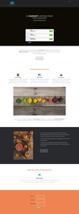

# ガイド付きランディングページテンプレートリスト {#guided-landing-page-template-list}

ガイド付きランディングページエディター](/help/marketo/product-docs/demand-generation/landing-pages/guided-landing-pages/create-a-guided-landing-page.md)で使用するサンプルテンプレートのコレクションを参照します。 [各テンプレートは完全にレスポンシブで、テンプレートフレームワークに基づいてBootstrapされます。

>[!NOTE]
>
>Marketoサポートは、HTMLのトラブルシューティングを支援するように設定されていません。 これらのテンプレートの変更に関するサポートが必要な場合は、Web開発者にお問い合わせください。

テンプレートをMarketoに読み込むには：

1. 大きなビューを表示するには、テンプレートの名前をクリックします。
1. 選択したテンプレートをダウンロードします。
1. Marketoで、**Design Studioに移動します。**
1. 左側のツリーで「**ランディングページ**」をクリックし、「**テンプレート**」を選択します。

1. メニューバーで、**Import Template.**&#x200B;をクリックします。
1. ダウンロードしたファイルを選択し、テンプレート名を入力して、「**読み込み**」をクリックします（わかりやすい名前を選択し、編集モードが&#x200B;**ガイド付き**&#x200B;であることを示します）。

|  |  |  |
|---|---|---|
| [テンプレート1 ～ A](guided-landing-page-templates/template-1-a.md) | [テンプレート1 ～ B](guided-landing-page-templates/template-1-b.md) | [テンプレート1 ～ C](guided-landing-page-templates/template-1-c.md) |
|  |  |  |
| [テンプレート1-D](guided-landing-page-templates/template-1-d.md) | [テンプレート1 ～ E](guided-landing-page-templates/template-1-e.md) | [テンプレート1 ～ F](guided-landing-page-templates/template-1-f.md) |
|  |  |  |
| [テンプレート2-A](guided-landing-page-templates/template-2-a.md) | [テンプレート2-B](guided-landing-page-templates/template-2-b.md) | [テンプレート2 ～ C](guided-landing-page-templates/template-2-c.md) |
|  |  |  |
| [テンプレート2-D](guided-landing-page-templates/template-2-d.md) | [テンプレート3-A](guided-landing-page-templates/template-3-a.md) | [テンプレート3-B](guided-landing-page-templates/template-3-b.md) |
|  |  |  |
| [テンプレート3 ～ C](guided-landing-page-templates/template-3-c.md) | [テンプレート3-D](guided-landing-page-templates/template-3-d.md) | [テンプレート4-A](guided-landing-page-templates/template-4-a.md) |
|  |  |  |
| [テンプレート4-B](guided-landing-page-templates/template-4-b.md) | [テンプレート4 ～ C](guided-landing-page-templates/template-4-c.md) | [テンプレート5-A](guided-landing-page-templates/template-5-a.md) |
|  |  |  |
| [テンプレート5-B](guided-landing-page-templates/template-5-b.md) | [テンプレート5 ～ C](guided-landing-page-templates/template-5-c.md) | [テンプレート5-D](guided-landing-page-templates/template-5-d.md) |
|  |  |  |
| [テンプレート5-E](guided-landing-page-templates/template-5-e.md) | [テンプレート6-A](guided-landing-page-templates/template-6-a.md) | [テンプレート6-B](guided-landing-page-templates/template-6-b.md) |
|  |  |  |
| [テンプレート6 ～ C](guided-landing-page-templates/template-6-c.md) | [テンプレート6-D](guided-landing-page-templates/template-6-d.md) | [テンプレート6-E](guided-landing-page-templates/template-6-e.md) |
|  |  |  |
| [テンプレート7-A](guided-landing-page-templates/template-7-a.md) | [テンプレート7-B](guided-landing-page-templates/template-7-b.md) | [テンプレート7 ～ C](guided-landing-page-templates/template-7-c.md) |
|  |  |  |
| [テンプレート7-D](guided-landing-page-templates/template-7-d.md) | [テンプレート7-E](guided-landing-page-templates/template-7-e.md) | [テンプレート7 ～ F](guided-landing-page-templates/template-7-f.md) |
|  |  |  |
| [テンプレート8-A](guided-landing-page-templates/template-8-a.md) | [テンプレート8-B](guided-landing-page-templates/template-8-b.md) | [テンプレート8 ～ C](guided-landing-page-templates/template-8-c.md) |
|  |  |  |
| [テンプレート8-D](guided-landing-page-templates/template-8-d.md) | [テンプレート8-E](guided-landing-page-templates/template-8-e.md) | [テンプレート8 ～ F](guided-landing-page-templates/template-8-f.md) |
|  |  |  |
| [テンプレート8-G](guided-landing-page-templates/template-8-g.md) | [テンプレート9-A](guided-landing-page-templates/template-9-a.md) | [テンプレート9-B](guided-landing-page-templates/template-9-b.md) |
|  |  |  |
| [テンプレート9 ～ C](guided-landing-page-templates/template-9-c.md) | [テンプレート9-D](guided-landing-page-templates/template-9-d.md) | [テンプレート9-E](guided-landing-page-templates/template-9-e.md) |
|  |  |  |
| [テンプレート9 ～ F](guided-landing-page-templates/template-9-f.md) | [テンプレート10-A](guided-landing-page-templates/template-10-a.md) | [テンプレート10-B](guided-landing-page-templates/template-10-b.md) |
|  |  |  |
| [テンプレート10 ～ C](guided-landing-page-templates/template-10-c.md) | [テンプレート10-D](guided-landing-page-templates/template-10-d.md) | [テンプレート10-E](guided-landing-page-templates/template-10-e.md) |
|  |  |  |
| [テンプレート10 ～ F](guided-landing-page-templates/template-10-f.md) | [テンプレート11-A](guided-landing-page-templates/template-11-a.md) | [テンプレート11-B](guided-landing-page-templates/template-11-b.md) |
|  |  |  |
| [テンプレート11 ～ C](guided-landing-page-templates/template-11-c.md) | [テンプレート11-D](guided-landing-page-templates/template-11-d.md) | [テンプレート11-E](guided-landing-page-templates/template-11-e.md) |
|  |  |  |
| [テンプレート11 ～ F](guided-landing-page-templates/template-11-f.md) | [テンプレート12-A](guided-landing-page-templates/template-12-a.md) | [テンプレート12-B](guided-landing-page-templates/template-12-b.md) |
|  |  |  |
| [テンプレート12-C](guided-landing-page-templates/template-12-c.md) | [テンプレート12-D](guided-landing-page-templates/template-12-d.md) | [テンプレート12-E](guided-landing-page-templates/template-12-e.md) |
|  |  |  |
| [テンプレート12-F](guided-landing-page-templates/template-12-f.md) | [テンプレート13-A](guided-landing-page-templates/template-13-a.md) | [テンプレート13-B](guided-landing-page-templates/template-13-b.md) |
|  |  |  |
| [テンプレート13-A](guided-landing-page-templates/template-13-c.md) | [テンプレート13-D](guided-landing-page-templates/template-13-d.md) | [テンプレート13-E](guided-landing-page-templates/template-13-e.md) |
|  |  |  |
| [テンプレート14-A](guided-landing-page-templates/template-14-a.md) | [テンプレート14-B](guided-landing-page-templates/template-14-b.md) | [テンプレート14 ～ C](guided-landing-page-templates/template-14-c.md) |
|  |  |  |
| [テンプレート14-D](guided-landing-page-templates/template-14-d.md) | [テンプレート14-E](guided-landing-page-templates/template-14-e.md) | [テンプレート15-A](guided-landing-page-templates/template-15-a.md) |
|  |  |  |
| [テンプレート15-B](guided-landing-page-templates/template-15-b.md) | [テンプレート15 ～ C](guided-landing-page-templates/template-15-c.md) | [テンプレート15-D](guided-landing-page-templates/template-15-d.md) |
|  |  |  |
| [テンプレート15-E](guided-landing-page-templates/template-15-e.md) | [テンプレート16-A](guided-landing-page-templates/template-16-a.md) | [テンプレート16-B](guided-landing-page-templates/template-16-b.md) |
|  |  |  |
| [テンプレート16 ～ C](guided-landing-page-templates/template-16-c.md) | [テンプレート16-D](guided-landing-page-templates/template-16-d.md) | [テンプレート16-E](guided-landing-page-templates/template-16-e.md) |
|  |  |  |
| [テンプレート17-A](guided-landing-page-templates/template-17-a.md) | [テンプレート17-B](guided-landing-page-templates/template-17-b.md) | [テンプレート17 ～ C](guided-landing-page-templates/template-17-c.md) |
|  |  |  |
| [テンプレート17-D](guided-landing-page-templates/template-17-d.md) | [テンプレート17-E](guided-landing-page-templates/template-17-e.md) | [テンプレート18-A](guided-landing-page-templates/template-18-a.md) |
|  |  |  |
| [テンプレート18-B](guided-landing-page-templates/template-18-b.md) | [テンプレート18-C](guided-landing-page-templates/template-18-c.md) | [テンプレート18-D](guided-landing-page-templates/template-18-d.md) |
|  |  |  |
| [テンプレート18-E](guided-landing-page-templates/template-18-e.md) | [テンプレート19-A](guided-landing-page-templates/template-19-a.md) | [テンプレート19-B](guided-landing-page-templates/template-19-b.md) |
|  |  |  |
| [テンプレート19-C](guided-landing-page-templates/template-19-c.md) | [テンプレート19-D](guided-landing-page-templates/template-19-d.md) | [テンプレート19-E](guided-landing-page-templates/template-19-e.md) |
|  |  |  |
| [テンプレート20-A](guided-landing-page-templates/template-20-a.md) | [テンプレート20-B](guided-landing-page-templates/template-20-b.md) | [テンプレート20 ～ C](guided-landing-page-templates/template-20-c.md) |
|  |  |  |
| [テンプレート20-D](guided-landing-page-templates/template-20-d.md) | [テンプレート20-E](guided-landing-page-templates/template-20-e.md) |  |
|  |  |  |
