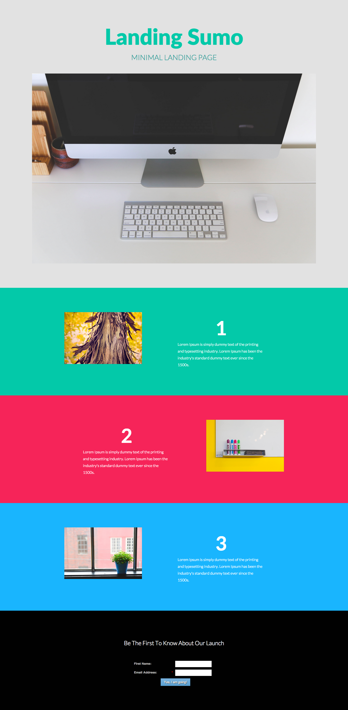

# テンプレート 10B {#template-10b}

右クリックして[テンプレート 10B をダウンロード](https://51837-micrositemarketo.adobeio-static.net/lp-templates/template-10b.html)します

このテンプレートには、次の内容が含まれます。

* プライマリセクション

  * ヒーローヘッダー、ヒーローテキスト、ヒーロー画像が含まれます

* 3 つの本文セクション（オプション）
* フッター（オプション）

**このテンプレートをダウンロードするには、以下を右クリックします。**

[Template 10B.html](https://51837-micrositemarketo.adobeio-static.net/lp-templates/template-10b.html)
