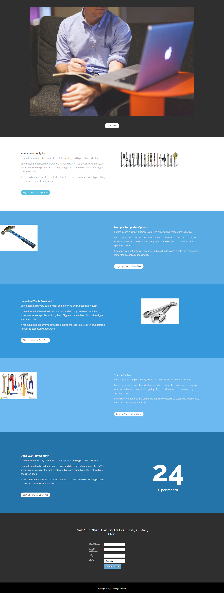

# テンプレート 15E {#template-15e}

右クリックして[テンプレート 15E をダウンロード](https://experienceleague.adobe.com/landing/marketo/lp-templates/template-15e.html)します

このテンプレートには、次の内容が含まれます。

* プライマリセクション

   * ヒーロー画像と「詳細」ボタンが含まれます

* 5 つの本文セクション（オプション）
* フッター（オプション）

**このテンプレートをダウンロードするには、以下を右クリックします。**

[テンプレート 15E.html](https://experienceleague.adobe.com/landing/marketo/lp-templates/template-15e.html)
