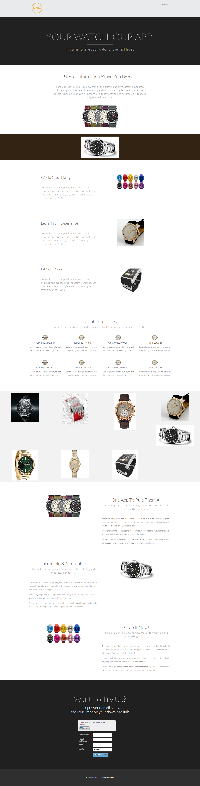

# テンプレート 16A {#template-16a}

右クリックして[テンプレート 16A をダウンロード](https://experienceleague.adobe.com/landing/marketo/lp-templates/template-16a.html)します

このテンプレートには、次の内容が含まれます。

* ヘッダー（オプション）
* プライマリセクション

   * ヒーロータイトルおよびヒーローテキストが含まれます

* 6 つの本文セクション
* フッター（オプション）

**このテンプレートをダウンロードするには、以下を右クリックします。**

[Template 16A.html](https://experienceleague.adobe.com/landing/marketo/lp-templates/template-16a.html)
