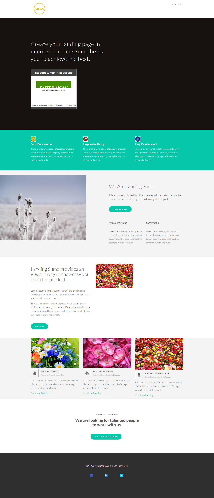

# テンプレート 18D {#template-18d}

右クリックして[テンプレート 18D をダウンロード](https://experienceleague.adobe.com/landing/marketo/lp-templates/template-18d.html)します

このテンプレートには、次の内容が含まれます。

* ヘッダー（オプション）
* プライマリセクション

   * ヒーローテキストと懸賞が含まれます

* 5 つの本文セクション（オプション）
* フッター（オプション）

**このテンプレートをダウンロードするには、以下を右クリックします。**

[テンプレート 18D.html](https://experienceleague.adobe.com/landing/marketo/lp-templates/template-18d.html)
