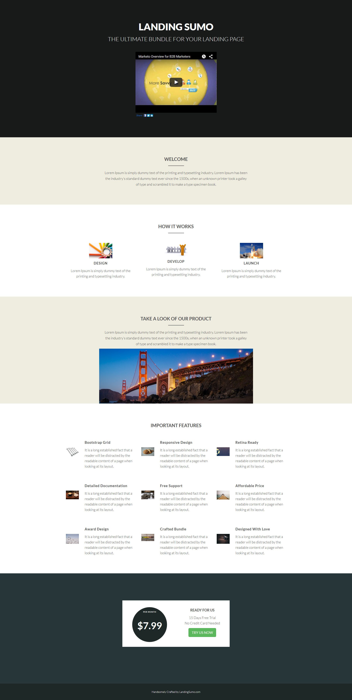

# テンプレート 20B {#template-20b}

[&#x200B; ダウンロードテンプレート 20B](https://51837-micrositemarketo.adobeio-static.net/lp-templates/template-20b.html)を右クリックし、**リンクを別名で保存…**&#x200B;を選択します

>[!NOTE]
>
>テンプレート [のダウンロードと読み込み方法に関する完全な手順については、こちらを参照してください](/help/marketo/product-docs/demand-generation/landing-pages/landing-page-templates/guided-landing-page-template-list.md#how-to-import){target="_blank"}。

このテンプレートには、次の内容が含まれます。

* プライマリセクション

  * ヒーロービデオおよびテキストが含まれます

* 4 つの本文セクション（オプション）
* フッター（オプション）

**下を右クリックし、_リンクを別名で保存…_を選択します。 このテンプレートをダウンロードするには：**

[Template 20B.html](https://51837-micrositemarketo.adobeio-static.net/lp-templates/template-20b.html)
