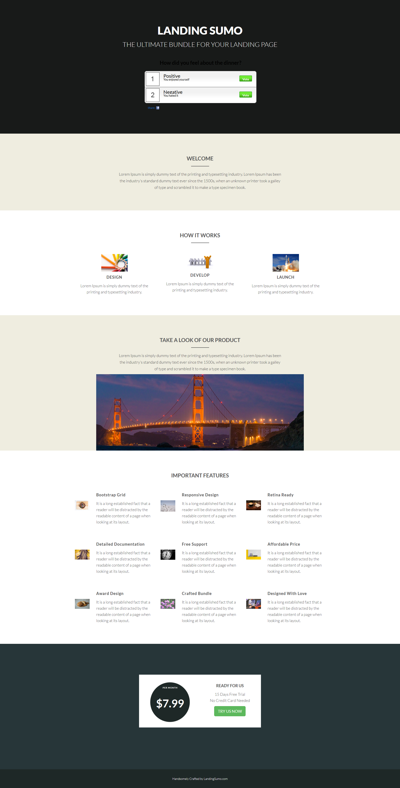

# テンプレート 20C {#template-20c}

右クリックして[テンプレート 20C をダウンロード](https://experienceleague.adobe.com/landing/marketo/lp-templates/template-20c.html)します

このテンプレートには、次の内容が含まれます。

* プライマリセクション

   * ヒーロー投票とテキストが含まれます

* 4 つの本文セクション（オプション）
* フッター（オプション）

**このテンプレートをダウンロードするには、以下を右クリックします。**

[テンプレート 20C.html](https://experienceleague.adobe.com/landing/marketo/lp-templates/template-20c.html)
