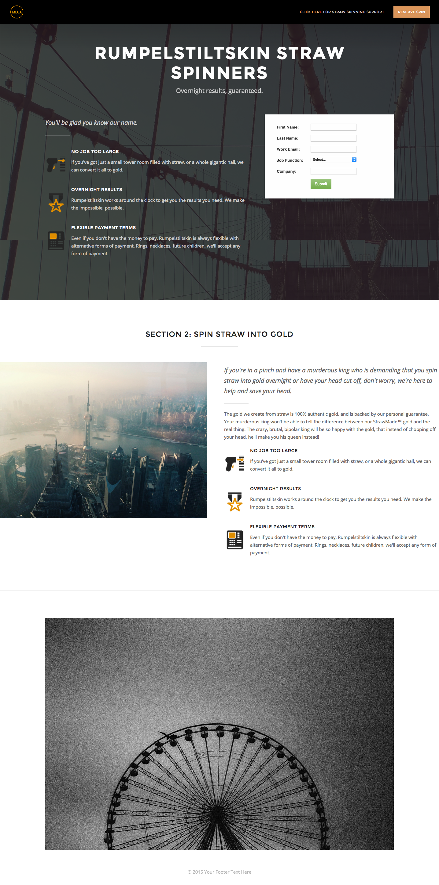

# テンプレート 2A {#template-2a}

右クリックして[テンプレート 2A をダウンロード](https://51837-micrositemarketo.adobeio-static.net/lp-templates/template-2a.html)します

このテンプレートには、次の内容が含まれます。

* ロゴおよびボタンを含むヘッダー（オプション）
* プライマリセクション

  * ヒーローの背景画像、ヘッダー、タグライン、箇条書きリストおよびフォームが含まれます。

* 本文セクション（オプション）
* フッター（オプション）

**このテンプレートをダウンロードするには、以下を右クリックします。**

[テンプレート 2A.html](https://51837-micrositemarketo.adobeio-static.net/lp-templates/template-2a.html)
