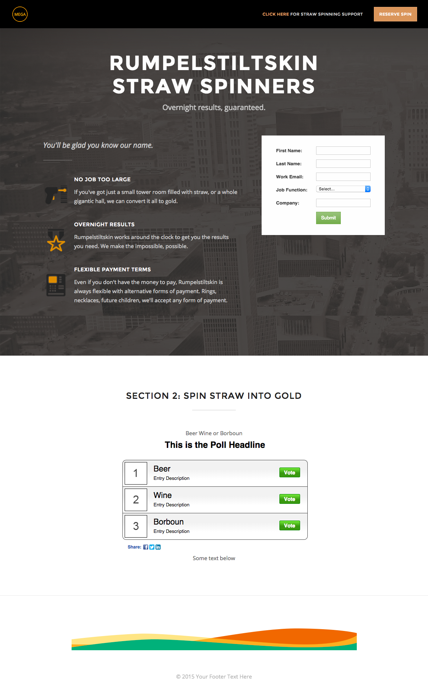

# テンプレート2D {#template-2d}

[テンプレート2Dのダウンロード](https://experienceleague.adobe.com/landing/marketo/lp-templates/template-2d.html)

このテンプレートには、次の内容が含まれます。

* ロゴおよびボタンを含むヘッダー（オプション）
* プライマリセクション

   * ヒーローの背景画像、ヘッダー、タグライン、箇条書きリストおよびフォームが含まれます。

* テキストとポールを含む1つのボディセクション（オプション）
* フッター（オプション）

**このテンプレートをダウンロードするには、次をクリックします。**

[テンプレート2D.html](https://experienceleague.adobe.com/landing/marketo/lp-templates/template-2d.html)
