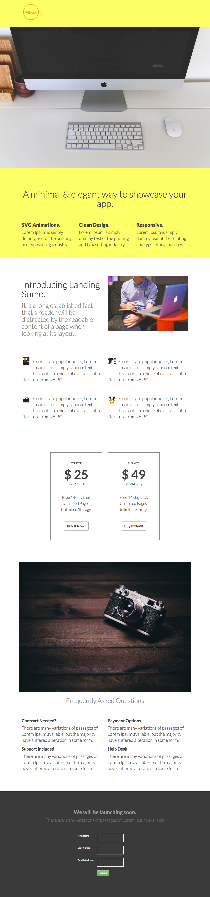

# テンプレート 5A {#template-5a}

右クリックして[テンプレート 5A をダウンロード](https://51837-micrositemarketo.adobeio-static.net/lp-templates/template-5a.html)します

このテンプレートには、次の内容が含まれます。

* ヘッダー（オプション）
* プライマリセクション

  * ヒーロー画像、ヒーロータイトル、説明文の箇条書き 3 つが含まれます。

* 3 つの本文セクション（オプション）
* フッター（オプション）

**このテンプレートをダウンロードするには、以下を右クリックします。**

[テンプレート 5A.html](https://51837-micrositemarketo.adobeio-static.net/lp-templates/template-5a.html)
