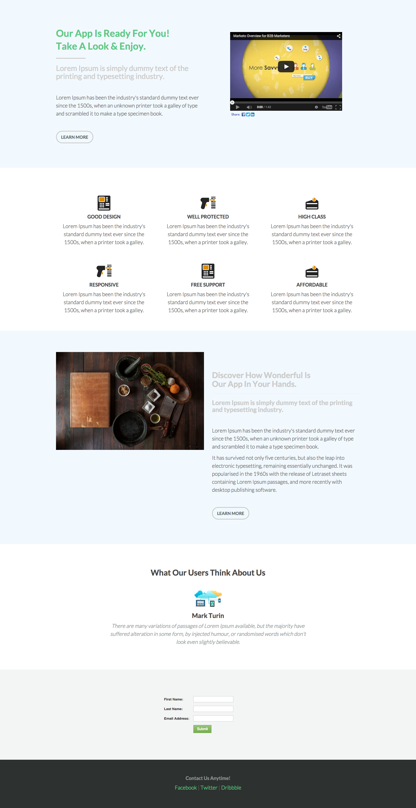

# テンプレート 6-D {#template-d}

[テンプレート 6-D をダウンロード](https://docs.marketo.com/download/attachments/8783935/template-6d.html?version=1&amp;modificationdate=1437693191000&amp;api=v2)

このテンプレートには、次の内容が含まれます。

* プライマリセクション

   * ヒーロービデオ、タイトル、サブタイトル、本文およびボタンが含まれます。

* 4 つの本文セクション（オプション）
* フッター（オプション）

**このテンプレートをダウンロードするには、次をクリックします。**

[Template6-D.html](https://docs.marketo.com/download/attachments/8783935/template-6d.html?version=1&amp;modificationdate=1437693191000&amp;api=v2)
