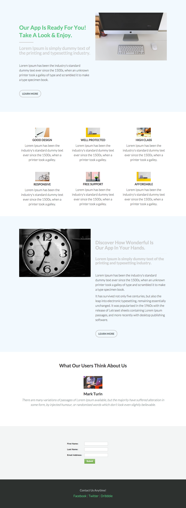

# テンプレート 6A {#template-6a}

[ ダウンロードテンプレート 6A](https://51837-micrositemarketo.adobeio-static.net/lp-templates/template-6a.html)を右クリックし、**リンクを別名で保存…**&#x200B;を選択します

>[!NOTE]
>
>テンプレート [のダウンロードと読み込み方法に関する完全な手順については、こちらを参照してください](/help/marketo/product-docs/demand-generation/landing-pages/landing-page-templates/guided-landing-page-template-list.md#how-to-import){target="_blank"}。

このテンプレートには、次の内容が含まれます。

* プライマリセクション

  * ヒーロー画像、タイトル、サブタイトル、本文、ボタンが含まれます。

* 4 つの本文セクション（オプション）
* フッター（オプション）

**下を右クリックし、_リンクを別名で保存…_を選択します。 このテンプレートをダウンロードするには：**

[テンプレート 6A.html](https://51837-micrositemarketo.adobeio-static.net/lp-templates/template-6a.html)
