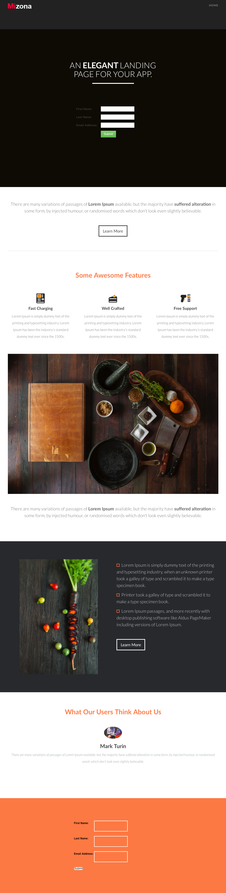

# テンプレート 7D {#template-7d}

右クリックして [Template 7D](https://experienceleague.adobe.com/landing/marketo/lp-templates/template-7d.html) をダウンロード

このテンプレートには、次の内容が含まれます。

* ヘッダー（オプション）
* プライマリセクション

   * ヘッダーおよびフォームが含まれます

* 4 つの本文セクション（オプション）
* フッター（オプション）

**下の右クリックでこのテンプレートをダウンロード：**

[Template 7D.html](https://experienceleague.adobe.com/landing/marketo/lp-templates/template-7d.html)
