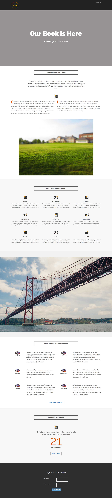

# テンプレート 8-A {#template-a}

[テンプレート 8-A をダウンロード](https://docs.marketo.com/download/attachments/8783960/template-8a.html?version=1&amp;modificationdate=1482174907000&amp;api=v2)

このテンプレートには、次の内容が含まれます。

* ヘッダー（オプション）
* プライマリセクション

   * ヒーローヘッダーとヒーローテキストを含む

* 5 つの本文セクション（オプション）
* フッター（オプション）

**このテンプレートをダウンロードするには、次をクリックします。**

[Template8-A.html](https://docs.marketo.com/download/attachments/8783960/template-8a.html?version=1&amp;modificationdate=1482174907000&amp;api=v2)
