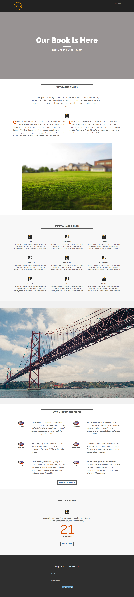

# テンプレート 8A {#template-8a}

右クリックして[テンプレート 8A をダウンロード](https://51837-micrositemarketo.adobeio-static.net/lp-templates/template-8a.html)します

このテンプレートには、次の内容が含まれます。

* ヘッダー（オプション）
* プライマリセクション

  * ヒーローヘッダーとヒーローテキストが含まれます

* 5 つの本文セクション（オプション）
* フッター（オプション）

**このテンプレートをダウンロードするには、以下を右クリックします。**

[テンプレート 8A.html](https://51837-micrositemarketo.adobeio-static.net/lp-templates/template-8a.html)
