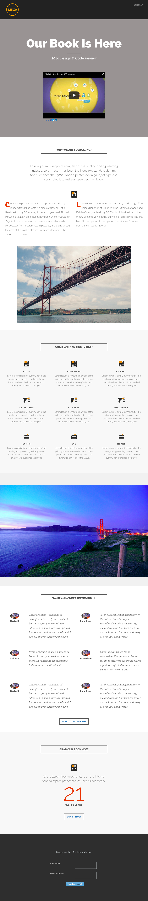

# テンプレート 8C {#template-8c}

[ ダウンロードテンプレート 8C](https://51837-micrositemarketo.adobeio-static.net/lp-templates/template-8c.html)を右クリックし、**リンクを別名で保存…**&#x200B;を選択します

>[!NOTE]
>
>テンプレート [のダウンロードと読み込み方法に関する完全な手順については、こちらを参照してください](/help/marketo/product-docs/demand-generation/landing-pages/landing-page-templates/guided-landing-page-template-list.md#how-to-import){target="_blank"}。

このテンプレートには、次の内容が含まれます。

* ヘッダー（オプション）
* プライマリセクション

  * ヒーローヘッダー、ヒーローテキスト、ビデオが含まれます

* 5 つの本文セクション（オプション）
* フッター（オプション）

**下を右クリックし、_リンクを別名で保存…_を選択します。 このテンプレートをダウンロードするには：**

[テンプレート 8C.html](https://51837-micrositemarketo.adobeio-static.net/lp-templates/template-8c.html)
