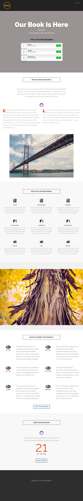

# テンプレート 8D {#template-8d}

右クリックして[テンプレート 8D をダウンロード](https://experienceleague.adobe.com/landing/marketo/lp-templates/template-8d.html?lang=ja)します

このテンプレートには、次の内容が含まれます。

* ヘッダー（オプション）
* プライマリセクション

   * ヒーローヘッダー、ヒーローテキスト、投票が含まれます

* 5 つの本文セクション（オプション）
* フッター（オプション）

**このテンプレートをダウンロードするには、以下を右クリックします。**

[Template 8D.html](https://experienceleague.adobe.com/landing/marketo/lp-templates/template-8d.html?lang=ja)
