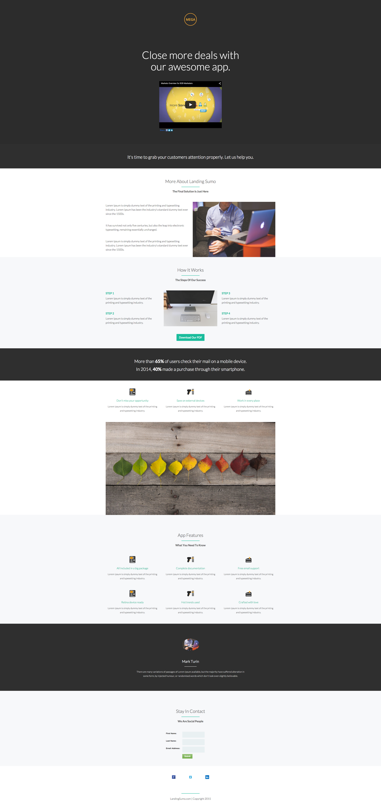

# テンプレート 9C {#template-9c}

右クリックして[テンプレート 9C をダウンロード](https://51837-micrositemarketo.adobeio-static.net/lp-templates/template-9c.html)します

このテンプレートには、次の内容が含まれます。

* プライマリセクション

  * ロゴ画像、ビデオ、ヒーローヘッダーが含まれます

* 8 つの本文セクション（オプション）
* フッター（オプション）

**このテンプレートをダウンロードするには、以下を右クリックします。**

[テンプレート 9C.html](https://51837-micrositemarketo.adobeio-static.net/lp-templates/template-9c.html)
