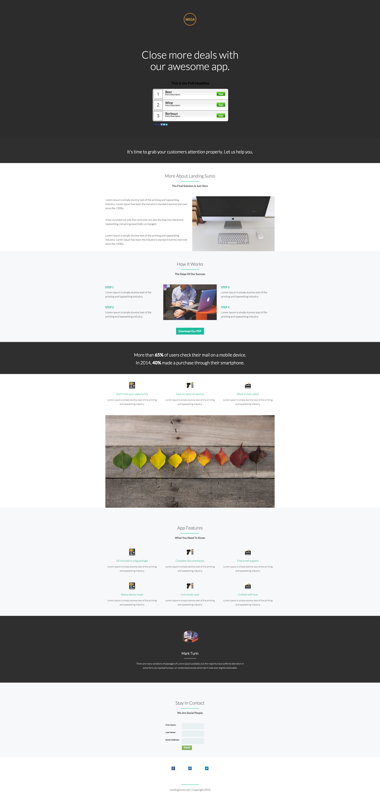

# テンプレート 9D {#template-9d}

右クリックして[テンプレート 9D をダウンロード](https://experienceleague.adobe.com/landing/marketo/lp-templates/template-9d.html?lang=ja)します

このテンプレートには、次の内容が含まれます。

* プライマリセクション

   * ロゴ画像、ヒーローヘッダー、投票が含まれます

* 8 つの本文セクション（オプション）
* フッター（オプション）

**このテンプレートをダウンロードするには、以下を右クリックします。**

[テンプレート 9D.html](https://experienceleague.adobe.com/landing/marketo/lp-templates/template-9d.html?lang=ja)
