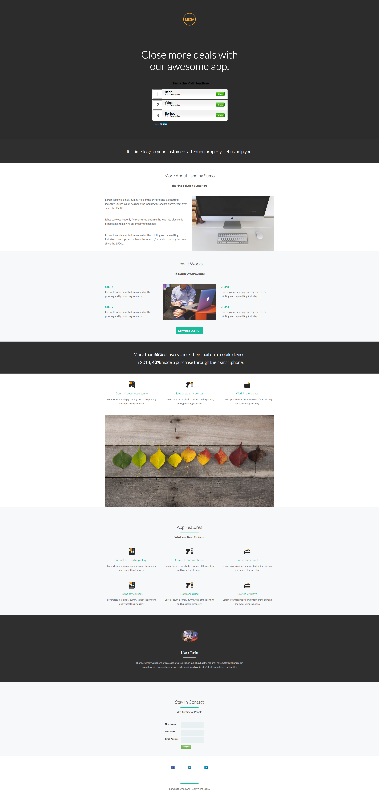

# テンプレート 9-D {#template-d}

[テンプレート 9-D をダウンロード](https://docs.marketo.com/download/attachments/8783990/template-9d.html?version=2&amp;modificationdate=1438210757000&amp;api=v2)

このテンプレートには、次の内容が含まれます。

* プライマリセクション

   * ロゴ画像、ヒーローヘッダーおよび投票を含む

* 8 つの本文セクション（オプション）
* フッター（オプション）

**このテンプレートをダウンロードするには、次をクリックします。**

[Template9-D.html](https://docs.marketo.com/download/attachments/8783990/template-9d.html?version=2&amp;modificationdate=1438210757000&amp;api=v2)
