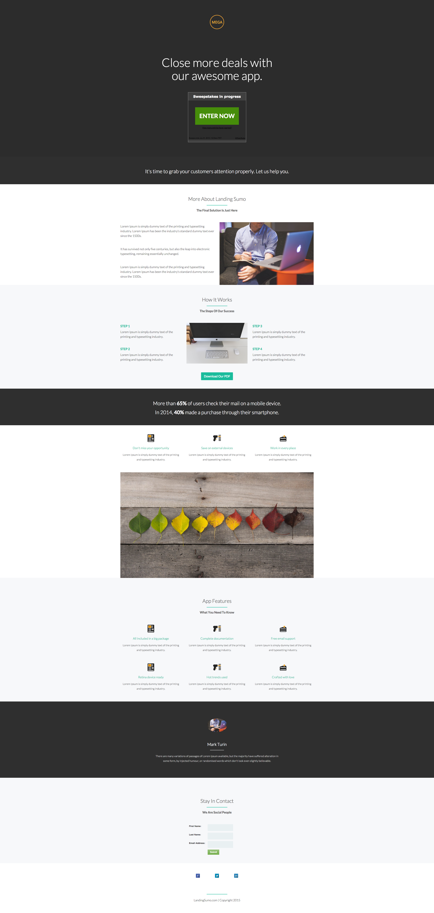

# テンプレート 9F {#template-9f}

右クリックして[テンプレート 9F をダウンロード](https://experienceleague.adobe.com/landing/marketo/lp-templates/template-9f.html?lang=ja)します

このテンプレートには、次の内容が含まれます。

* プライマリセクション

   * ロゴ画像、ヒーローヘッダー、懸賞が含まれます

* 8 つの本文セクション（オプション）
* フッター（オプション）

**このテンプレートをダウンロードするには、以下を右クリックします。**

[Template 9F.html](https://experienceleague.adobe.com/landing/marketo/lp-templates/template-9f.html?lang=ja)
