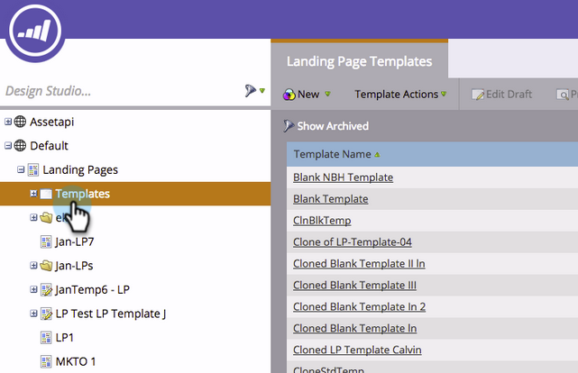
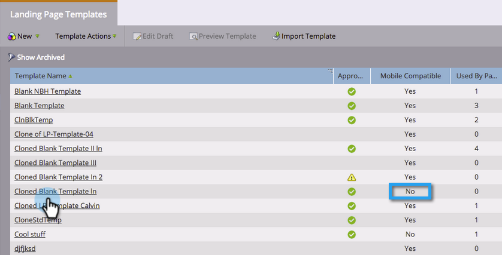
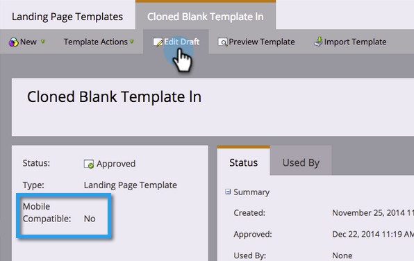
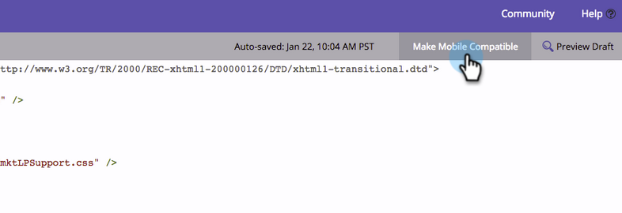
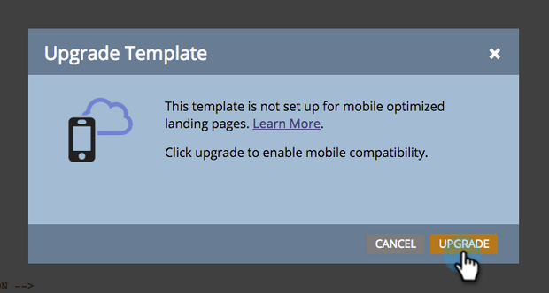
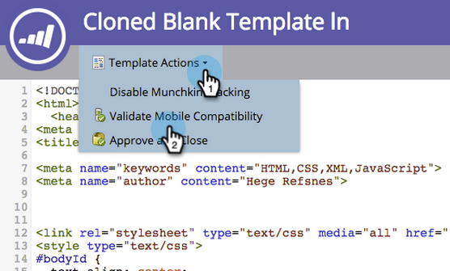
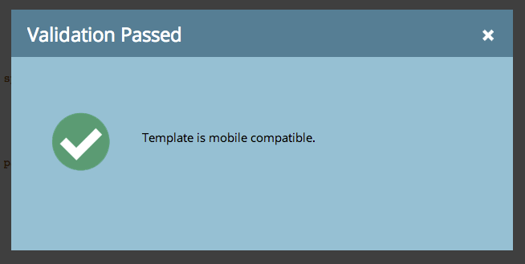
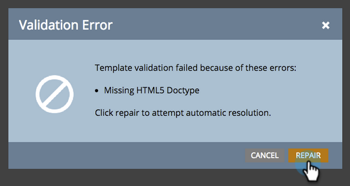
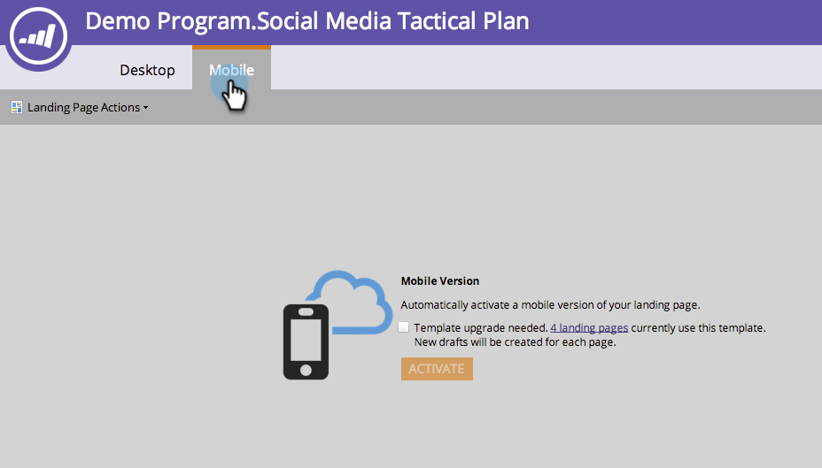
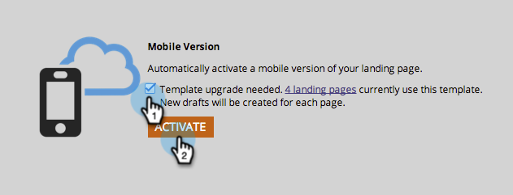

# 既存のフリーフォームランディングページテンプレートのモバイルとの互換性の確保 {#make-an-existing-free-form-landing-page-template-mobile-compatible}

これは、テンプレートエディターとランディングページエディターの 2 か所でおこなえます。

## テンプレートエディターからアップグレードする {#upgrade-from-the-template-editor}

1. **[!UICONTROL Design Studio]** に移動します。

   

1. 「**[!UICONTROL テンプレート]**」を選択します。

   

1. **[!UICONTROL モバイル互換]**&#x200B;が&#x200B;**[!UICONTROL いいえ]**&#x200B;のテンプレートを選択します。

   

1. **[!UICONTROL ドラフトの編集]**&#x200B;をクリックします。

   

1. 「**[!UICONTROL モバイルに対応させる]**」をクリックします。

   

1. 「**[!UICONTROL アップグレード]**」をクリックします。

   

   ランディングページテンプレートがモバイル対応になりました。

   >[!NOTE]
   >
   >アップグレードは安全ですが、ページに食い違いがないかを確認してください。 アップグレードすると、そのテンプレートを使用するすべてのランディングページのドラフトが作成されます。

   

## テンプレートを[!UICONTROL モバイルに対応]させる理由は何ですか？ {#what-makes-a-template-mobile-compatible}

テンプレートには次のタグが必要です。

```
Must have <!DOCTYPE HTML> 
Must have a <HEAD> element 
Must have a <TITLE> in the <HEAD> element 
Must have <META CHARSET="UTF-8"> within the <HEAD> element 
Must have a <BODY> element that contains one (and only one) <DIV class="mktoContent"></DIV>
```

問題がない場合は、次のメッセージが表示されます。



問題が発生した場合は、エラーメッセージが表示されるので、「修復」をクリックして問題を修正し、検証プロセスを繰り返します。



テンプレートに変更を加える場合は、**[!UICONTROL テンプレートアクション]**&#x200B;をクリックし、**[!UICONTROL モバイル互換性の検証]**&#x200B;を選択します。

## フリーフォームランディングページエディターからのテンプレートのアップグレード {#upgrading-a-template-from-the-free-form-landing-page-editor}

ランディングページを編集する際に「モバイル」タブをクリックすると、テンプレートがアップグレードされていないことがあります。 大丈夫です。 そのテンプレートは、その場ですぐにアップグレードできます。

1. 「**[!UICONTROL モバイル]**」タブをクリックします。

   

1. チェックボックスをクリックして、「**[!UICONTROL 有効にする]**」をクリックします。

   

   >[!NOTE]
   >
   >テンプレートのモバイル版をアクティベートすると、そのテンプレートを使用するランディングページのドラフトが作成されます。

このテンプレートを使用するすべてのランディングページの[モバイル表示をカスタマイズ](/help/marketo/product-docs/demand-generation/landing-pages/free-form-landing-pages/customize-mobile-view-for-your-free-form-landing-page.md)できます。
