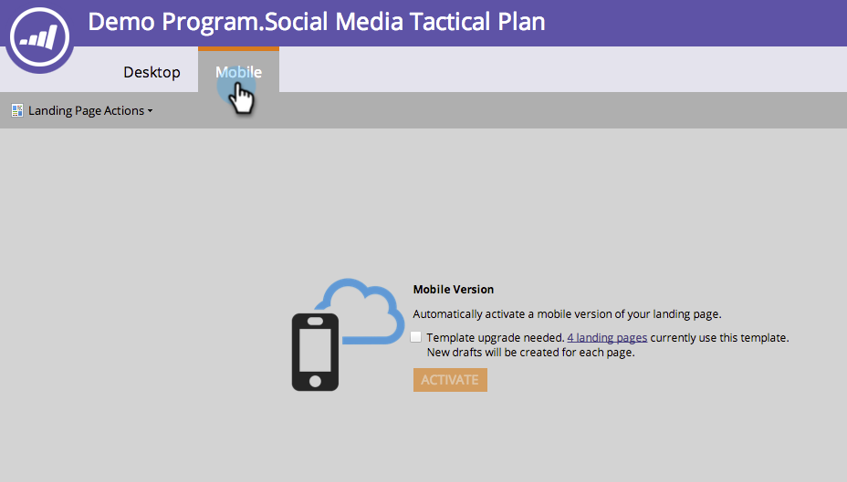

# 既存のフリーフォームランディングページテンプレートとモバイルとの互換性の設定{#make-an-existing-free-form-landing-page-template-mobile-compatible}

>[!NOTE]
>
>[2015年1月リリース](../../../../release-notes/2015/release-notes-january-2015.md)より前に作成されたランディングページテンプレートは、モバイルとの互換性を持たせるためにアップグレードする必要があります。

これは、ランディングページエディターとテンプレートエディターの2か所で行うことができます。

## テンプレートエディターからのアップグレード{#upgrade-from-the-template-editor}

1. **Design Studio**&#x200B;に移動します。

   

1. 「**テンプレート**」を選択します。

   

1. **モバイル互換**&#x200B;が&#x200B;**なし**&#x200B;であるテンプレートを選択します。

   

1. 「**ドラフトを編集**」をクリックします。

   

1. 「**モバイルと互換性を持たせる**」をクリックします。

   

1. 「**アップグレード**」をクリックします。

   

   ランディングページテンプレートはモバイルとの互換性が確保されました。

   >[!NOTE]
   >
   >アップグレードは安全ですが、ページに食い違いがないかどうかを確認してください。 アップグレードすると、そのテンプレートを使用するランディングページのドラフトが作成されます。

   

## テンプレートモバイルとの互換性{#what-makes-a-template-mobile-compatible}

素晴らしい質問です！ テンプレートには次のタグが必要です。

`<pre data-theme="Confluence">Must have <!DOCTYPE HTML> Must have a <HEAD> element Must have a <TITLE> in the <HEAD> element Must have <META CHARSET="UTF-8"> within the <HEAD> element Must have a <BODY> element that contains one (and only one) 

</pre>`  問題がない場合は、次のメッセージが表示されます。

問題が発生した場合は、エラーメッセージが表示されます。「修復」をクリックして問題を修正し、検証プロセスを繰り返します。

テンプレートに変更を加えた場合は、「テンプレートのアクション」をクリックし、「モバイルの互換性を検証」を選択します。

## フリーフォームランディングページエディタからのテンプレートのアップグレード{#upgrading-a-template-from-the-free-form-landing-page-editor}

ランディングページを編集中に「モバイル」タブをクリックすると、テンプレートがアップグレードされていないことに気付く場合があります。 恐れない！ アップグレードは、すぐに行えます。

1. 「**モバイル**」タブをクリックします。

   

1. チェックボックスをクリックし、「**アクティブ化**」をクリックします。

   

   >[!NOTE]
   >
   >モバイルバージョンのテンプレートをアクティブ化すると、それを使用するランディングページのドラフトが作成されます。

すごい！ これで、このテンプレートを使用するすべてのランディングページのモバイル表示](../../../../product-docs/demand-generation/landing-pages/free-form-landing-pages/customize-mobile-view-for-your-free-form-landing-page.md)を[カスタマイズできます。

>[!MORELIKETHIS]
>
>* [フリーフォームランディングページ用のモバイル表示のカスタマイズ](../../../../product-docs/demand-generation/landing-pages/free-form-landing-pages/customize-mobile-view-for-your-free-form-landing-page.md)

>

