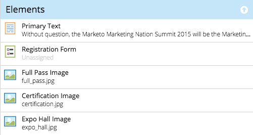
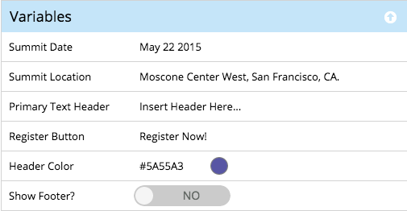

# ガイド付きテンプレートの要素と変数について {#understanding-elements-and-variables-in-guided-templates}

ガイド付きランディングページテンプレートには、要素と変数という 2 種類の編集可能なセクションがあります。

## 要素 {#elements}

要素とは、ランディングページを構成する様々なコンテンツです。 これには、画像、テキスト、Marketo アセットなどがあります。

ガイド付きランディングページを編集する際、テンプレートで編集可能とマークされている要素が表示されます。 要素には次のアイコンが表示されます。

*  画像
* Marketo フォーム
* テキスト
* 動画
* Marketo 共有ボタン
* Marketo 投票
* Marketo リファラル
* Marketo 懸賞
* Marketo スニペット

## 変数 {#variables}

変数は、以下のように、ガイド付きランディングページエディターからカスタマイズできる、トークンに似た属性です。

変数には、文字列変数、カラー変数、ブール変数の 3 種類があります。

<table>
 <tbody>
  <tr>
   <td>文字列</td>
   <td>
編集可能なテキスト

例：タイトル、日付、ボタンラベル
</td>
  </tr>
  <tr>
   <td>色</td>
   <td>
カラーの編集可能な 16 進コード

例：背景色、フォントの色、ボーダーの色
</td>
  </tr>
  <tr>
   <td>ブール値</td>
   <td>
ランディングページ上のオブジェクトまたはフォーマットのオン／オフ状態を制御するレバー

例：フッターを表示（はい／いいえ）、列数（1／2）、埋め込み Google Analytics（True／False）
</td>
  </tr>
 </tbody>
</table>

>[!MORELIKETHIS]
>
>[ガイド付きランディングページテンプレートの作成](/help/marketo/product-docs/demand-generation/landing-pages/landing-page-templates/create-a-guided-landing-page-template.md)
