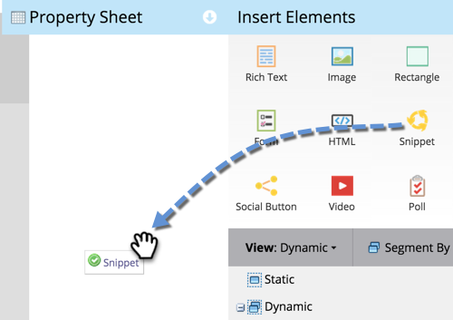

# ランディングページ追加{#add-a-snippet-to-a-landing-page}のスニペット

スニペットは、HTMLの一部で、ルールに従ってパーソナライズされたコンテンツを保持することができます。

>[!PREREQUISITES]
>
>[スニペットの作成](/help/marketo/product-docs/personalization/segmentation-and-snippets/snippets/create-a-snippet.md)

1. ランディングページを選択し、「**ドラフトを編集**」をクリックします。

   

1. ランディングページエディターで、**スニペット**&#x200B;要素の上にドラッグします。

   

1. スニペットを探して選択し、「**保存**」をクリックします。

   

   >[!TIP]
   >
   >スニペットが見つからない場合は、まずスニペットが承認されていることを確認してください。

   >[!NOTE]
   >
   >ガイド付きランディングページにスニペットを追加する場合は、[この記事](/help/marketo/product-docs/demand-generation/landing-pages/landing-page-templates/create-a-guided-landing-page-template.md)を参照してください。

すごい仕事！ ランディングページにスニペットを追加する方法を理解している。
