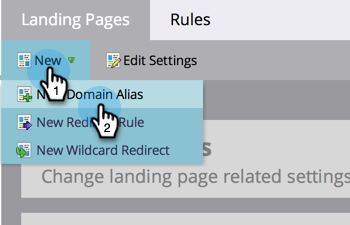

# 付加的なランディングページ CNAME の追加 {#add-additional-landing-page-cnames}

様々な URL で Marketo のランディングページを指すように、ランディングページの CNAME を追加することができます。次の手順に従うと、複数のドメインを管理するのに役立ちます。

>[!CAUTION]
>
>Cookie は、ドメイン間で共有できません。

>[!TIP]
>
>**同じトップレベルドメイン — 可能Cookie が共有されます**.  **go**.mycompany.com > **info**.mycompany.com
>
>**異なるトップレベルドメイン — 不可能cookie は共有&#x200B;_されません。_**  go.**mycompany**.com > go.**mynewcompany**.com

>[!NOTE]
>
>**管理者権限が必要**

1. 「**管理者**」領域に移動します。

   

1. 「**マイアカウント**」をクリックします。

   

1. 下にスクロールして&quot;Support Information&quot;を開き、Munchkin ID をコピーします。

   

## IT にリクエストを送信する {#send-request-to-it}

1. 担当の IT 部門に、次の CNAME を設定するよう依頼します。( [CNAME] を選択し、 [Munchkin ID] 前の手順のテキストを含む )。

   [CNAME].YourCompany.com > [Munchkin ID].mktoweb.com

## 新しい CNAME を追加する {#add-a-new-cname}

1. IT 部門が CNAME を作成したら、 **管理者** 領域

   

1. 「**ランディングページ**」をクリックします。

   

1. 「**新規**」をクリックして、「**新規ドメインエイリアス**」を選択します。

   

1. **ドメインエイリアス**&#x200B;を入力します。訪問者が URL を入力しない場合、**デフォルトのページ**&#x200B;が表示されます。その場合の移動先を入力します。

   >[!NOTE]
   >
   >デフォルトページの場合は、ランディングページまたは公開 Web サイトなどの外部 URL を選択できます。

   

1. **デフォルトページ**&#x200B;を入力して、「**作成**」をクリックします。

   

作業は以上です。これで、CNAME を追加したい場合の対処方法を理解できました。
