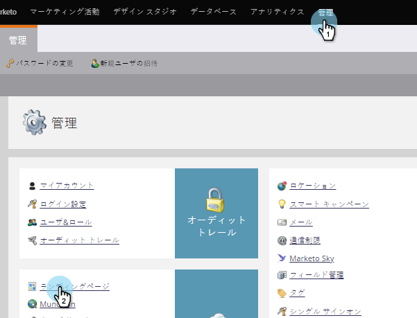

# 追加追加のランディングページCNAME {#add-additional-landing-page-cnames}

様々なURLがマーケティング担当者のランディングページを指すようにランディングページCNAMEを追加する必要がある場合があります。 次の手順に従って、複数のドメインを管理します。

>[!CAUTION]
>
>Cookieはドメイン間で共有できません。

>[!TIP]
>
>**同じトップレベルドメイン — 良い！cookieはshared.go**.mycompany.com > **info**.mycompany.com **異なるトップレベルドメイン — BAD! Cookieは共有されません。**
>行け。**mycompany**.com/go。**mynewcompany**.com

>[!NOTE]
>
>**必要な管理者権限**

## アカウント文字列{#find-your-account-string}を検索

1. **管理者**&#x200B;領域に移動し、**ランディングページ**&#x200B;をクリックします。

   

1. **アカウント文字列**&#x200B;を&#x200B;**設定**&#x200B;セクションからコピーします。

   

1. 次の手順でメモしておきます。

## リクエストをITに送信{#send-request-to-it}

1. IT部門に次のCNAMEを設定するよう依頼します。（「[CNAME]」という語を任意のCNAMEに、「[ACCOUNT STRING]」を前の手順のテキストに置き換えます）。

   [CNAME].YourCompany.com >  [ACCOUNT STRING].mktoweb.com

## 追加新しいCNAME {#add-a-new-cname}

1. IT部門がCNAMEを作成したら、**管理者**&#x200B;に移動し、**ランディングページ**&#x200B;をクリックします。

   

1. 「**新規**」をクリックし、「**新しいドメインエイリアス**」を選択します。

   

1. **ドメインエイリアスを入力します。** 訪問者がURLを入力しない場合は、 **デフォルト** ページが表示されます。その場合は、どこに移動するかを入力します。

   >[!NOTE]
   >
   >デフォルトページでは、ランディングページまたは公開Webサイトなどの外部URLを選択できます。

   

1. **デフォルトのページ**&#x200B;を入力し、**作成**&#x200B;をクリックします。

   

ナイス！ これで、CNAMEを追加したい場合の対処方法がわかります。
