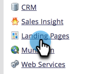
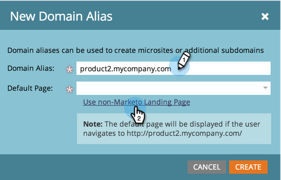

# 付加的なランディングページ CNAME の追加 {#add-additional-landing-page-cnames}

様々な URL で Marketo のランディングページを指すように、ランディングページの CNAME を追加することができます。 次の手順に従うと、複数のドメインを管理するのに役立ちます。

>[!CAUTION]
>
>Cookie は、ドメイン間で共有できません。

>[!TIP]
>
>**同じトップレベルドメイン — 可能 Cookie が共有されます**.  **go**.mycompany.com > **info**.mycompany.com
>
>**異なるトップレベルドメイン — 不可能 Cookieは&#x200B;_共有されていません_**.  go.**mycompany**.com > go.**mynewcompany**.com

>[!NOTE]
>
>**管理者権限が必要**

1. 「**管理者**」領域に移動します。

   

1. 「**マイアカウント**」をクリックします。

   

1. 「サポート情報」まで下にスクロールし、Munchkin ID をコピーします。

   

## IT にリクエストを送信する {#send-request-to-it}

1. 担当の IT 部門に、次の CNAME を設定するよう依頼します（[CNAME] を希望する CNAME で置き換え、[Munchkin ID] を前の手順のテキストで置き換えます)。

   [CNAME].YourCompany.com／[Munchkin ID].mktoweb.com

## 新しい CNAME を追加する {#add-a-new-cname}

1. IT 部門で CNAME が作成されたら、「**管理者**」領域に移動します。

   

1. 「**ランディングページ**」をクリックします。

   

1. 「**[!UICONTROL 新規]**」をクリックして、「**[!UICONTROL 新規ドメインエイリアス]**」を選択します。

   

1. **[!UICONTROL ドメインエイリアス]**&#x200B;を入力します。 訪問者がURLを入力しない場合、**[!UICONTROL デフォルトページ]**&#x200B;が表示されます。 その場合の移動先を入力します。

   >[!NOTE]
   >
   >[!UICONTROL デフォルトページ]の場合は、ランディングページまたは公開 web サイトなどの外部 URL を選択できます。

   

1. **[!UICONTROL デフォルトページ]**&#x200B;を入力して、「**[!UICONTROL 作成]**」をクリックします。

   

これで、ランディングページにCNAMEを追加する方法が分かりました。
