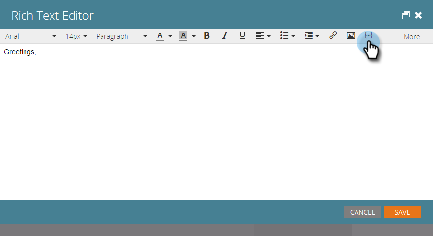

# ランディングページ追加へのテキストとトークン{#add-text-and-tokens-to-a-landing-page}

>[!NOTE]
>
>トークンは、Marketoランディングページでのみサポートされます。

## ランディングページ追加に対するリッチテキスト{#add-rich-text-to-your-landing-page}

1. ランディングページを選択し、「**ドラフトを編集**」をクリックします。

   

   >[!NOTE]
   >
   >ランディングページデザイナーが新しいウィンドウで開きます。

1. **リッチテキスト**&#x200B;要素の上にドラッグします。

   

1. 目的のテキストを入力し、「**保存**」をクリックします。

   

ランディングページにテキストを追加する方法を理解したら、トークンの追加に取り組みます。

## ランディングページ追加へのトークン{#add-a-token-to-your-landing-page}

トークンは、ランディングページをパーソナライズするための動的なテキストの一部です。

>[!TIP]
>
>名などは人物レコードから来ています。 その他のトークンは、プログラムの「マイトークン」タブから取得されます。

1. ランディングページを選択し、「**ドラフトを編集**」をクリックします。

   

   >[!NOTE]
   >
   >ランディングページデザイナーが新しいウィンドウで開きます。

1. トークンを追加するリッチテキストボックスを重複クリックします。

   

1. 「トークンの挿入」アイコンをクリックします。

   

1. 目的のトークンを探して選択します。

   

1. **デフォルト値**&#x200B;を入力し、**挿入**&#x200B;をクリックします。

   

1. 「**保存**」をクリックします。

   

   任務完了！ これで、ランディングページにトークンが付きました。
