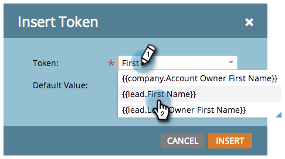

# ランディングページへのテキストとトークンの追加 {#add-text-and-tokens-to-a-landing-page}

>[!NOTE]
>
>トークンは Marketo のランディングページでのみサポートされています。

## ランディングページへのリッチテキストの追加 {#add-rich-text-to-your-landing-page}

1. ランディングページを選択し、「**[!UICONTROL ドラフトを編集]**」をクリックします。

   

   >[!NOTE]
   >
   >ランディングページデザイナーが新しいウィンドウで開きます。

1. **[!UICONTROL リッチテキスト]**&#x200B;要素をドラッグします。

   

1. 目的のテキストを入力し、「**[!UICONTROL 保存]**」をクリックします。

   

ランディングページにテキストを追加する方法を理解したところで、次の節ではトークンの追加について説明します。

## ランディングページへのトークンの追加 {#add-a-token-to-your-landing-page}

トークンは、ランディングページをパーソナライズできる動的なテキストビットです。

>[!TIP]
>
>「名」などの値は、個人レコードから取得されます。 その他のトークンは、プログラムの「マイトークン」タブから取得されます。

1. ランディングページを選択し、「**[!UICONTROL ドラフトを編集]**」をクリックします。

   

   >[!NOTE]
   >
   >ランディングページデザイナーが新しいウィンドウで開きます。

1. トークンを追加するリッチテキストボックスをダブルクリックします。

   

1. トークンを挿入アイコンをクリックします。

   

1. 目的のトークンを探して選択します。

   

1. **[!UICONTROL デフォルト値]**&#x200B;を入力し、「**[!UICONTROL 挿入]**」をクリックします。

   

1. 「**[!UICONTROL 保存]**」をクリックします。

   

   これで、ランディングページにトークンが追加されました。
