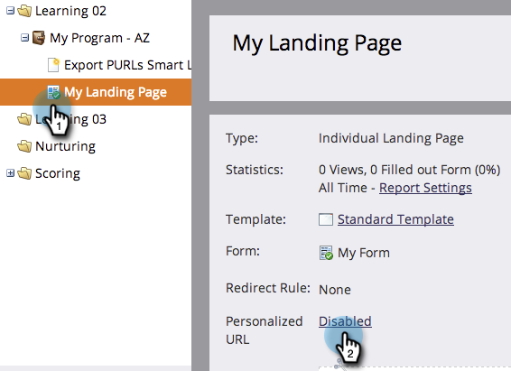

# ランディングページでパーソナライズ URL を有効にする {#enable-personalized-urls-for-a-landing-page}

パーソナライズ URL は、招待状を郵送するなど紙媒体のキャンペーンをおこなうのに適しています。

>[!PREREQUISITES]
>
>[アカウントでパーソナライズ URL を有効にする](/help/marketo/product-docs/demand-generation/landing-pages/personalizing-landing-pages/enable-personalized-urls-for-your-account.md)

1. ランディングページを選択し、**パーソナライズ URL** の設定をクリックします。

   

1. 「**パーソナライズ URL の有効化**」チェックボックスを選択し、「**保存**」をクリックします。

   

完成です。これで、ランディングページに対してパーソナライズされた URL を有効にしました。この URL を使用する訪問者が認識され、トークンが正しく機能します。
