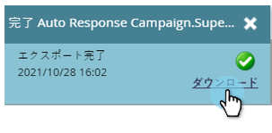

# パーソナライズされたURLを含むリストの書き出し{#export-a-list-with-personalized-urls}

>[!PREREQUISITES]
>
>* [アカウントに合わせたパーソナライズされたURLの有効化](/help/marketo/product-docs/demand-generation/landing-pages/personalizing-landing-pages/enable-personalized-urls-for-your-account.md)
>* [ランディングページ向けにパーソナライズされたURLを有効にする](/help/marketo/product-docs/demand-generation/landing-pages/personalizing-landing-pages/enable-personalized-urls-for-a-landing-page.md)

1. リストまたはスマートリストを選択し、「**Leads**」タブをクリックして結果を取得し、Excelアイコンをクリックします。 インライン&#x200B;**マーケティング先の一意のコード**&#x200B;と&#x200B;**マーケティング先の一意の名前** [列が表示](/help/marketo/product-docs/core-marketo-concepts/smart-lists-and-static-lists/using-smart-lists/create-and-change-views-for-lists-and-smart-list.md)されていることを確認します。

   

1. 「**パーソナライズされたURLを含める**」をオンにし、PURLを生成するランディングページを探して選択します。

   

1. **URL**&#x200B;を選択します。

   

   >[!TIP]
   >
   >同じランディングページに対して複数のURLが表示される場合、これは、過去のある時点でページのURLを変更し、リダイレクトを作成したことが原因である可能性があります。

1. **スタイル**&#x200B;を選択し、**書き出し**&#x200B;をクリックします。

   

1. エクスポートが完了したら、「**今すぐダウンロード**」リンクをクリックしてファイルを保存します。

   

   終わった！ これで、リードとパーソナライズされたURLのリストが得られます。

   

   >[!NOTE]
   >
   >名と姓が同じリードがある場合、URLが一意であることを確認するために、番号が自動的に追加されます。
