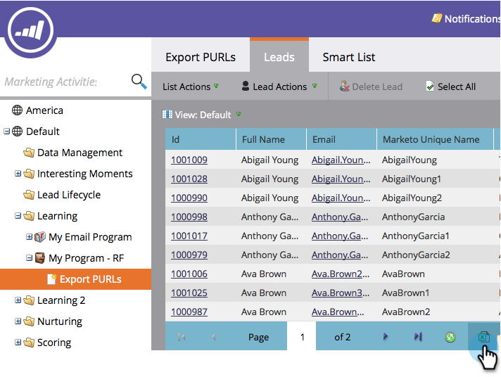
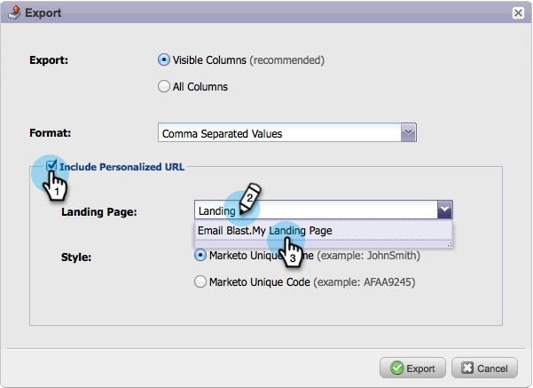
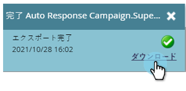

# パーソナライズされた URL を含むリストのエクスポート {#export-a-list-with-personalized-urls}

>[!PREREQUISITES]
>
>* [アカウントでパーソナライズ URL を有効にする](/help/marketo/product-docs/demand-generation/landing-pages/personalizing-landing-pages/enable-personalized-urls-for-your-account.md)
>* [ランディングページでパーソナライズ URL を有効にする](/help/marketo/product-docs/demand-generation/landing-pages/personalizing-landing-pages/enable-personalized-urls-for-a-landing-page.md)

1. リストまたはスマートリストを選択し、「**[!UICONTROL リード]**」タブをクリックして結果を取得し、Excel アイコンをクリックします。 **[!UICONTROL Marketo固有コード]**&#x200B;と&#x200B;**[!UICONTROL Marketo固有の名前]** [列が表示されていることを確認してください](/help/marketo/product-docs/core-marketo-concepts/smart-lists-and-static-lists/using-smart-lists/create-and-change-views-for-lists-and-smart-list.md)。

   

1. 「**[!UICONTROL パーソナライズ URL を含める]**」のチェックをオンにして、PURL を生成するランディングページを見つけて選択します。

   

1. **URL**.を選択します。

   

   >[!TIP]
   >
   >同じランディングページに複数のURLが表示される場合は、過去のある時点でページのURLを変更し、リダイレクトを作成したことが原因である可能性があります。

1. 「**[!UICONTROL スタイル]**」を選択して「**[!UICONTROL エクスポート]**」をクリックします。

   

1. 書き出しが完了したら、「**[!UICONTROL 今すぐダウンロード]**」リンクをクリックしてファイルを保存します。

   

   

   >[!NOTE]
   >
   >姓と名が同じリードがある場合は、URL が一意であることを保証するために、数字が自動的に追加されます。
