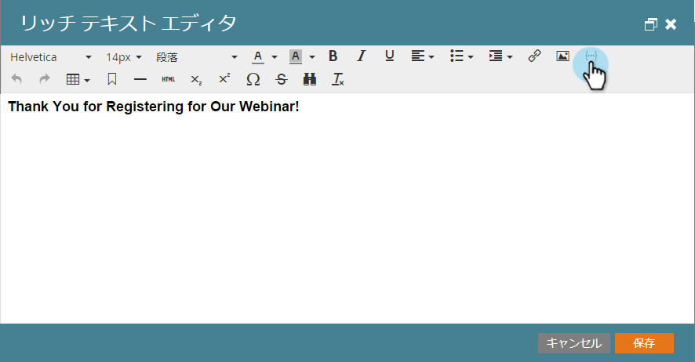
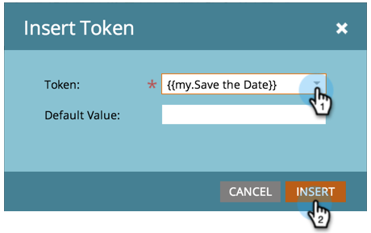

# ランディングページにカレンダーイベントの ICS ファイルを追加する {#include-a-calendar-event-ics-file-in-a-landing-page}

**カレンダーファイル**&#x200B;トークンを使用すると、Marketo のランディングページにカレンダーイベント（.ics）のリンクを追加できます。

>[!PREREQUISITES]
>
>* [カレンダーイベント（.ics）ファイルを作成する](/help/marketo/product-docs/email-marketing/general/functions-in-the-editor/create-a-calendar-event-ics-file.md)

1. ランディングページエディターで、**{...}**&#x200B;をクリックしてトークンを挿入します。

   

1. **カレンダーファイル**&#x200B;トークンを選択して「**挿入**」をクリックします。

   >[!CAUTION]
   >
   >次のトークンは、ランディングページでは使用できません。
   >
   >* member.webinar URL

   

1. 「**保存**」をクリックします。

   次のようなランディングページがリードに表示されるようになります。

   

できましたね。これで、すべてうまく機能しているはずです。テストは忘れずに実行してください。

>[!MORELIKETHIS]
>
>[メールにカレンダーイベント（.ics）を追加する](/help/marketo/product-docs/email-marketing/general/functions-in-the-editor/include-a-calendar-event-ics-in-an-email.md)
