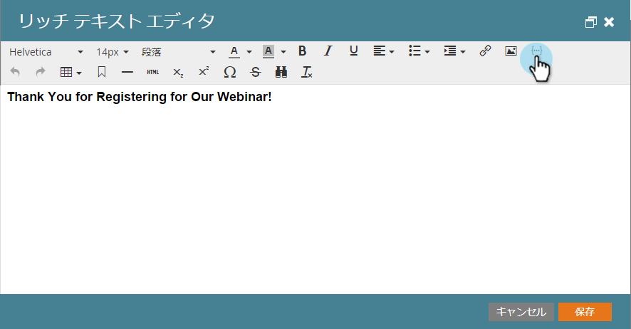
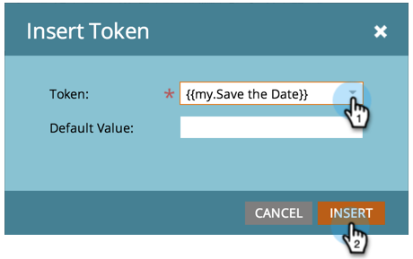
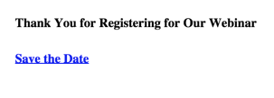

# ランディングページにカレンダーイベントの ICS ファイルを追加する {#include-a-calendar-event-ics-file-in-a-landing-page}

**[!UICONTROL カレンダーファイル]**&#x200B;トークンを使用すると、Marketo のランディングページにカレンダーイベント（.ics）のリンクを追加できます。

>[!PREREQUISITES]
>
>* [カレンダーイベント（.ics）ファイルを作成する](/help/marketo/product-docs/email-marketing/general/functions-in-the-editor/create-a-calendar-event-ics-file.md)

1. ランディングページエディターで、「**{...}**」をクリックしてトークンを挿入します。

   

1. **[!UICONTROL カレンダーファイル]**&#x200B;トークンを選択して「**[!UICONTROL 挿入]**」をクリックします。

   >[!CAUTION]
   >
   >次のトークンは、ランディングページでは使用できません。
   >
   >* member.webinar URL

   

1. 「**[!UICONTROL 保存]**」をクリックします。

   次のようなランディングページが表示されます。

   

ランディングページを承認する前に、必ずカレンダーリンクをテストしてください。

>[!MORELIKETHIS]
>
>[メールへのカレンダーイベント（.ics）の追加](/help/marketo/product-docs/email-marketing/general/functions-in-the-editor/include-a-calendar-event-ics-in-an-email.md)
