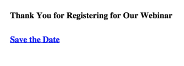

# ランディングページに予定表イベントのICSファイルを含める {#include-a-calendar-event-ics-file-in-a-landing-page}

カレン **ダーファイル** トークンを使用すると、Marketorランディングページにカレンダーイベント(.ics)リンクを追加できます。

>[!NOTE]
>
>**前提条件**
>
>* [予定表イベント(.ics)ファイルの作成](../../../../product-docs/email-marketing/general/functions-in-the-editor/create-a-calendar-event-ics-file.md)

>

1. ランディングページエディターで、 **{...}** をクリックしてトークンを挿入します。

   

1. カレン **ダーファイル** ・トークンを選択し、「 **挿入**」をクリックします。

   >[!CAUTION]
   >
   >次のトークンは、ランディングページではサポートされていません。
   >
   >    
   >    
   >    * member.webinar URL

   

1. 「 **保存**」をクリックします。

   次のようなランディングページが表示されます。   

甘い！ 今は全てうまくいくはずだ。 必ずテストを行ってください。

>[!NOTE]
>
>**関連記事**
>
>* [電子メールにカレンダーイベント(.ics)を含める](../../../../product-docs/email-marketing/general/functions-in-the-editor/include-a-calendar-event-ics-in-an-email.md)

>

