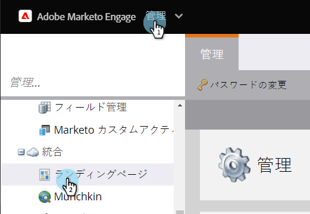
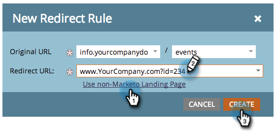

# URLパスのリダイレクト {#redirect-a-url-path}

Marketorでは、選択したページにURLパスを簡単にリダイレクトできます。 これが方法です。

>[!NOTE]
>
>**必要な管理者権限**

1. 「 **管理者」の下の** 「 **ランディングページ**」をクリックします。

   

1. 「 **ルール** 」タブをクリックし、「**新規**」および「 **新規リダイレクトルール**」をクリックします。

   

1. 最初の「 **オリジナルURL** 」ドロップダウンをクリックし、マーケティング担当者のCNAMEを選択します。

   

   >[!NOTE]
   >
   >**Reminder**
   >
   >
   >リダイレクトできるのは、Marketo CNAMEとの開始に関するURLだけで [す](../../../../product-docs/demand-generation/landing-pages/landing-page-actions/customize-your-landing-page-urls-with-a-cname.md)。

1. 右側の2番目の「 **オリジナルURL** 」フィールドに、リダイレクトするURLパス（または特定のページ）を入力します。

   

1. 「マーケティング担当者以外のランディングページ **を使用**」をクリックし、訪問者のリダイレクト先のページを「 **リダイレクトURL** 」フィールドに入力して、「 **作成**」をクリックします。

   

   宛先としてMarketoランディングページ [を](https://docs.marketo.com/x/vAEk) 使用することもできます。

おめでとう！  URLパスが正常にリダイレクトされました。

>[!NOTE]
>
>**関連記事**
>
>* [マーケティング先ランディングページを別のページにリダイレクト](../../../../product-docs/demand-generation/landing-pages/landing-page-actions/redirect-a-marketo-landing-page-to-another-page.md)

>

