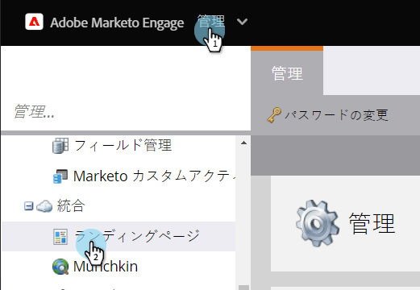
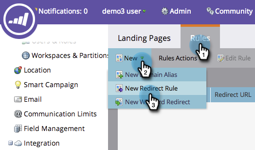
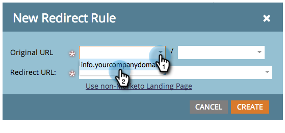
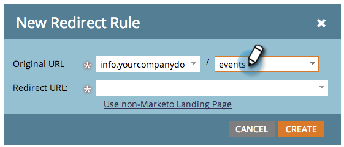
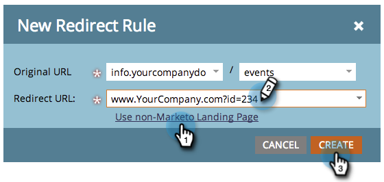

# URL パスをリダイレクトする {#redirect-a-url-path}

Marketo を使用すると、任意のページに URL パスを簡単にリダイレクトできます。

>[!NOTE]
>
>**管理者権限が必要**

1. 「**[!UICONTROL 管理者]**」で「**[!UICONTROL ランディングページ]**」をクリックします。

   

1. 「**[!UICONTROL ルール]**」タブをクリックしてから、**[!UICONTROL 新規]**／**[!UICONTROL 新規リダイレクトルール]**&#x200B;をクリックします。

   

1. 最初の&#x200B;**[!UICONTROL オリジナル URL]** ドロップダウンをクリックして、自分の Marketo CNAME を選択します。

   

   >[!NOTE]
   >
   >自分の Marketo [CNAME](/help/marketo/product-docs/demand-generation/landing-pages/landing-page-actions/customize-your-landing-page-urls-with-a-cname.md) で始まる URL のみをリダイレクトできます。

1. 右にある 2 番目の&#x200B;**[!UICONTROL オリジナル URL]** フィールドに、リダイレクトする URL パス（または特定のページ）を入力します。

   

1. 「**[!UICONTROL 非 Marketo ランディングページを使用]**」をクリックして、訪問者をリダイレクトするページを「**[!UICONTROL リダイレクト URL]**」フィールドに入力して、「**[!UICONTROL 作成]**」をクリックします。

   

   [Marketo ランディングページ](/help/marketo/product-docs/demand-generation/landing-pages/landing-page-actions/redirect-a-marketo-landing-page-to-another-page.md)を宛先として使用することもできます。

URL パスが正常にリダイレクトされました。

>[!MORELIKETHIS]
>
>[Marketo のランディングページを別のページにリダイレクト](/help/marketo/product-docs/demand-generation/landing-pages/landing-page-actions/redirect-a-marketo-landing-page-to-another-page.md)
