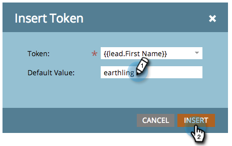

# トークンの概要{#tokens-overview}

トークンは、マーケティング担当者[スマートキャンペーン](http://docs.marketo.com/display/DOCS/Smart+Campaigns)のフローステップ、[電子メール](http://docs.marketo.com/display/DOCS/General)、[ランディングページ](http://docs.marketo.com/display/DOCS/Landing+Pages)、[スニペット](http://docs.marketo.com/display/DOCS/Segmentation+and+Snippets)、[webキャンペーン](http://docs.marketo.com/display/public/DOCS/Using+the+Web+Personalization+Rich+Text+Editor)で使用できる変数です。

## デフォルト値について{#understanding-default-values}

トークンを使用する場合は、デフォルト値も指定する必要があります。 これは、参照しているフィールドの値がユーザーにない場合に表示するテキストです。

この例では、電子メールは「Greetings, (first name)」または「Greetings, earthling」（デフォルト値）と表示されます。

>[!CAUTION]
>
>Marketoの電子メールエディターを使用している場合、プリヘッダーでトークンが機能しません。 プリヘッダーでトークンを使用するには、電子メールテンプレート内の独自のHTMLを使用する必要があります。

>[!NOTE]
>
>このリストは完全なものではありません。 また、Marketoにあるすべてのカスタムフィールドに対して、トークンが作成されます。

## 人物トークン{#person-tokens}

* `{{lead.Acquisition Date}}`
* `{{lead.Acquisition Program Name}}`
* `{{lead.Acquisition Program}}`
* `{{lead.Address}}`
* `{{lead.Anonymous IP}}`
* `{{lead.Black Listed}}`
* `{{lead.City}}`
* `{{lead.Country}}`
* `{{lead.Created At}}`
* `{{lead.Date of Birth}}`
* `{{lead.Department}}`
* `{{lead.Do Not Call}}`
* `{{lead.Do Not Call Reason}}`
* `{{lead.Email Address}}`
* `{{lead.Email Invalid}}`
* `{{lead.Email Invalid Cause}}`
* `{{lead.Fax Number}}`
* `{{lead.First Name}}`
* `{{lead.Full Name}}`
* `{{lead.Id}}`
* `{{lead.Inferred City}}`
* `{{lead.Inferred Company}}`
* `{{lead.Inferred Country}}`
* `{{lead.Inferred Metropolitan Area}}`
* `{{lead.Inferred Phone Area Code}}`
* `{{lead.Inferred Postal Code}}`
* `{{lead.Inferred State Region}}`
* `{{lead.Is Customer}}`
* `{{lead.Is Employee}}`
* `{{lead.Is Partner}}`
* `{{lead.Job Title}}`
* `{{lead.Last Name}}`
* `{{lead.Lead Source}}`
* `{{lead.Marketing Suspended}}`
* `{{lead.Middle Name}}`
* `{{lead.Mobile Phone Number}}`
* `{{lead.Original Referrer}}`
* `{{lead.Original Search Engine}}`
* `{{lead.Original Search Phrase}}`
* `{{lead.Original Source Info}}`
* `{{lead.Original Source Type}}`
* `{{lead.Person Notes}}`
* `{{lead.Phone Number}}`
* `{{lead.Registration Source Info}}`
* `{{lead.Registration Source Type}}`
* `{{lead.Salutation}}`
* `{{lead.SFDC Created Date}}`
* `{{lead.SFDC Is Deleted}}`
* `{{lead.SFDC Type}}`
* `{{lead.Unsubscribed}}`
* `{{lead.Unsubscribed Reason}}`
* `{{lead.Updated At}}`
* ユーザー設定のユーザーフィールドも、`{{lead.Custom Field Name}}`のように表示名を使用する場合にも機能します

## 会社トークン{#company-tokens}

* `{{Company.Account Owner Email Address}}`
* `{{Company.Address}}`
* `{{Company.Annual Revenue}}`
* `{{Company.City}}`
* `{{Company.Company Name}}`
* `{{Company.Company Notes}}`
* `{{Company.Country}}`
* `{{Company.Industry}}`
* `{{Company.Main Phone}}`
* `{{Company.Num Employees}}`
* `{{Company.Parent Company Name}}`
* `{{Company.Postal Code}}`
* `{{Company.SFDC Account Num}}`
* `{{Company.SFDC Created Date}}`
* `{{Company.SFDC Type}}`
* `{{Company.SIC Code}}`
* `{{Company.Site}}`
* `{{Company.State}}`
* `{{Company.Website}}`
* カスタム会社フィールドも、表示名exを使用する場合は機能します。`{{Company.Custom Field Name}}`

## キャンペーントークン{#campaign-tokens}

* `{{campaign.name}}`
* `{{campaign.id}}`
* `{{campaign.description}}`

## システムトークン{#system-tokens}

>[!NOTE]
>
>これらのトークンの詳細については、[システムトークン用語集](/help/marketo/product-docs/email-marketing/general/using-tokens/system-tokens-glossary.md)を参照してください。

* `{{system.date}}`
* `{{system.time}}`
* `{{system.dateTime}}`
* `{{system.forwardToFriendLink}}`
* `{{system.unsubscribeLink}}`
* `{{system.viewAsWebpageLink}}`

## トークンをトリガー{#trigger-tokens}

* `{{trigger.Trigger Name}}`
* `{{trigger.Name}}`
* `{{trigger.Link}}`
* `{{trigger.Subject}}`
* `{{trigger.Category}}`
* `{{trigger.Details}}`
* `{{trigger.Web Page}}`
* `{{trigger.Client IP Address}}`
* `{{trigger.Sent By}}`
* `{{trigger.Received By}}`
* `{{trigger.Referrer}}`
* `{{trigger.Search Engine}}`
* `{{trigger.Search Query}}`

>[!NOTE]
>
>スマートキャンペーンで使用されるトリガーに基づいて、興味深い瞬間](/help/marketo/product-docs/marketo-sales-insight/msi-for-salesforce/features/tabs-in-the-msi-panel/interesting-moments/tokens-for-interesting-moments.md)の[トークンの詳細を見つけます。

## プログラムトークン{#program-tokens}

* `{{program.Name}}`

* `{{program.Description}}`

* `{{program.id}}`

## マイトークン{#my-tokens}

My Tokensはプログラム内で定義され、`{{my.`で始まり、トークンに対して作成した名前が続きます。 [プログラム](/help/marketo/product-docs/core-marketo-concepts/programs/tokens/understanding-my-tokens-in-a-program.md)のマイトークンについての詳細。

## メンバトークン{#member-token}

メンバートークンは、統合サービスパートナーから一意の値を挿入するために使用されます。 メンバートークンは、ウェビナーの出席者固有のURLに使用するのが一般的です。 各ユーザーは、ウェビナーにアクセスするための固有のURLを持っており、`{{member.webinar url}}`トークンを使用して挿入できます。 `{{member.webinar url}}`トークンは、サービスプロバイダーが生成したユーザー固有の確認URLを自動的に解決します。

* `{{member.webinar url}}`

>[!CAUTION]
>
>`{{member.webinar url}}`トークンは、電子メールを送信するスマートキャンペーンがイベントプログラムの子アセットである場合にのみ入力されます。
