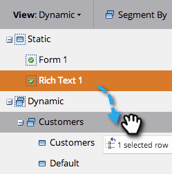
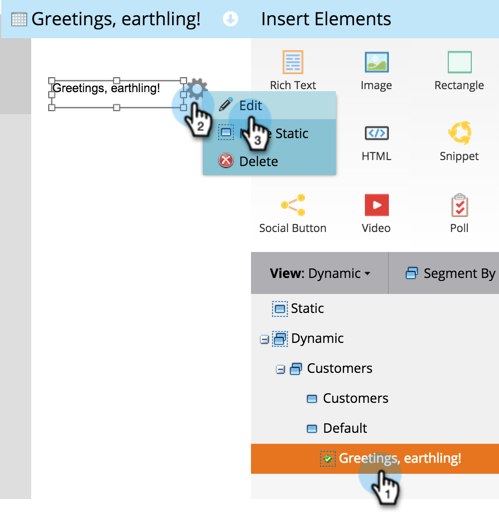
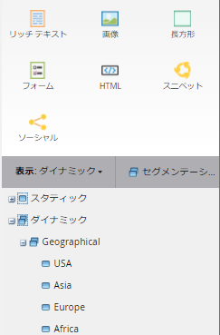

# ランディングページでの動的コンテンツの使用 {#use-dynamic-content-in-a-landing-page}

>[!NOTE]
>
>**前提条件**
>
>* [セグメントの作成](../../../../product-docs/personalization/segmentation-and-snippets/segmentation/create-a-segmentation.md)
>* [フリーフォームランディングページの作成](../../../../product-docs/demand-generation/landing-pages/free-form-landing-pages/create-a-free-form-landing-page.md)
>* [フ追加リーフォームランディングページへの新しいフォーム](../../../../product-docs/demand-generation/landing-pages/free-form-landing-pages/add-a-new-form-to-a-free-form-landing-page.md)

>

動的コンテンツをランディングページで使用すると、ユーザーはターゲット情報に関与します。

## 追加分類 {#add-segmentation}

1. 「 **マーケティングアクティビティ**」に移動します。

   

   ランディングページをクリックし、「ドラフトを編集」をクリックします。

   

   「セグメント基準」をクリックします。

   

   セグメント名を入力し、「保存」をクリックします。

   

   セグメントとそのセグメントが右側の「動的」の下に表示されます。

   

   >[!NOTE]
   >
   >デフォルトでは、すべてのランディングページ要素は静的です。

## 要素を動的にする {#make-element-dynamic}

1. エレメントを「静的」から「 **動的**」にドラッグ&amp;ドロップします。

   

1. 要素の **設定から、要素を静的または動的にすることもできます**。

   

## 動的コンテンツの適用 {#apply-dynamic-content}

1. セグメントの下の要素を選択し、「 **編集**」をクリックします。 各セグメントに対して同じ手順を繰り返します。

   

1. 緑のチェックマークは、セグメントに固有のコンテンツを示します。 空白は、デフォルトのセグメントコンテンツを示します。

   

   >[!CAUTION]
   >
   >デフォルトのセグメントコンテンツブロックに対する変更は、すべてのセグメントに適用されます。

   >[!TIP]
   >
   >様々なセグメントのコンテンツを変更する前に、デフォルトのランディングページを作成します。

よし！ ターゲットコンテンツを送信できるようになりました。

>[!NOTE]
>
>**関連記事**
>
>* [動的コンテンツを使用したランディングページのプレビュー](../../../../product-docs/demand-generation/landing-pages/landing-page-actions/preview-a-landing-page-with-dynamic-content.md)
>* [電子メールでの動的コンテンツの使用](../../../../product-docs/email-marketing/general/functions-in-the-editor/using-dynamic-content-in-an-email.md)

>

