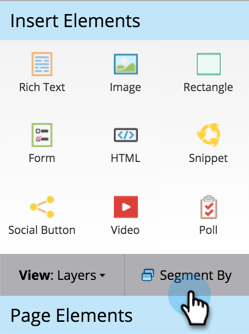
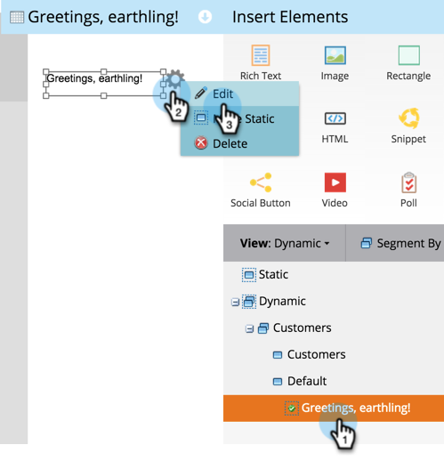
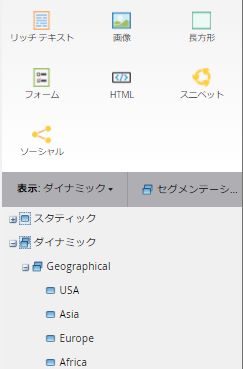

# ランディングページでの動的コンテンツの使用 {#use-dynamic-content-in-a-landing-page}

>[!PREREQUISITES]
>
>* [セグメント化の作成](/help/marketo/product-docs/personalization/segmentation-and-snippets/segmentation/create-a-segmentation.md)
>* [フリーフォームランディングページの作成](/help/marketo/product-docs/demand-generation/landing-pages/free-form-landing-pages/create-a-free-form-landing-page.md)
>* [フリーフォームランディングページへの新しいフォームの追加](/help/marketo/product-docs/demand-generation/landing-pages/free-form-landing-pages/add-a-new-form-to-a-free-form-landing-page.md)

ランディングページで動的コンテンツを使用すると、ターゲット情報に関心が生じます。

## セグメント化を追加 {#add-segmentation}

1. **[!UICONTROL マーケティングアクティビティ]**&#x200B;に移動します。

   

   **[!UICONTROL ランディングページ]**&#x200B;をクリックしてから、「**[!UICONTROL ドラフトを編集]**」をクリックします。

   

   「**[!UICONTROL セグメント基準]**」をクリックします。

   

   「**[!UICONTROL セグメント化名]**」を入力して、「**[!UICONTROL 保存]**」をクリックします。

   

   セグメント化とそのセグメントは、右側の「**[!UICONTROL 動的]**」の下に表示されます。

   

   >[!NOTE]
   >
   >すべてのランディングページ要素は、デフォルトでは&#x200B;**[!UICONTROL 静的]**&#x200B;です。

## 要素を動的にする {#make-element-dynamic}

1. 「**[!UICONTROL 静的]**」から「**[!UICONTROL 動的]**」に要素をドラッグ＆ドロップします。

   

1. また、要素[!UICONTROL 設定]から、要素を[!UICONTROL 静的]または&#x200B;**[!UICONTROL 動的]**&#x200B;にすることもできます。

   

## 動的コンテンツの適用 {#apply-dynamic-content}

1. セグメントの下の要素を選択し、「**[!UICONTROL 編集]**」をクリックします。 各セグメントに対して繰り返します。

   

1. 緑色のチェックマークは、セグメントに固有のコンテンツを示します。 空白はデフォルトのセグメントコンテンツを示します。

   

   >[!CAUTION]
   >
   >デフォルトのセグメントコンテンツブロックに対する変更は、すべてのセグメントに適用されます。

   >[!TIP]
   >
   >様々なセグメントのコンテンツを変更する前に、デフォルトのランディングページを作成します。

これで、セグメントにターゲットコンテンツを送信できます。

>[!MORELIKETHIS]
>
>* [動的コンテンツを含むランディングページのプレビュー](/help/marketo/product-docs/demand-generation/landing-pages/landing-page-actions/preview-a-landing-page-with-dynamic-content.md)
>* [メールでの動的コンテンツの使用](/help/marketo/product-docs/email-marketing/general/functions-in-the-editor/using-dynamic-content-in-an-email.md)
