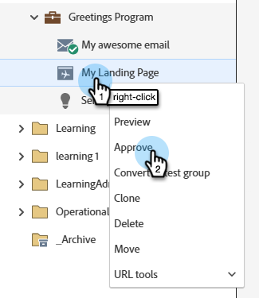
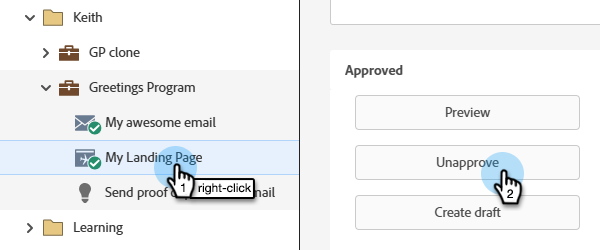
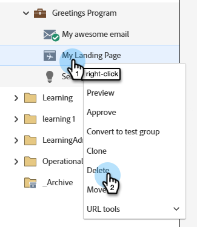
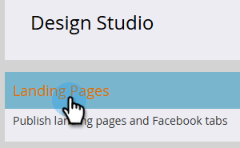
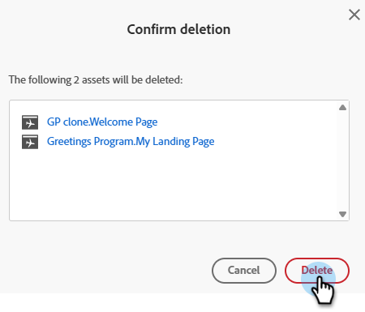

# ランディングページの承認、未承認、削除 {#approve-unapprove-or-delete-a-landing-page}

ランディングページは承認するまでドラフトモードです。 承認をおこなうと、残りのシステムでページを使用できるようになります。 承認済みのランディングページを編集すると、Marketo Engageはドラフトを保存しますが、ドラフトを承認するまで承認済みのバージョンを使用し続けます。

## ランディングページの承認 {#approve-a-landing-page}

1. 目的のランディングページを選択し、**[!UICONTROL 下書きを承認]**&#x200B;をクリックします。

   

   >[!TIP]
   >
   >必要に応じて、[一度に複数のページを承認](/help/marketo/product-docs/demand-generation/landing-pages/landing-page-actions/approve-multiple-landing-pages-at-once.md)することができます。

左側のナビゲーションでランディングページを右クリックし、**[!UICONTROL 承認]**&#x200B;を選択することもできます。

>[!NOTE]
>
>承認済みのランディングページには、緑色のチェックマークが追加されています。

## ランディングページの承認取消 {#unapprove-a-landing-page}

1. 目的のランディングページを選択し、**[!UICONTROL 承認しない]**&#x200B;をクリックします。

   

左側のナビゲーションでランディングページを右クリックし、**[!UICONTROL 未承認]**&#x200B;を選択することもできます。

>[!NOTE]
>
>未承認のランディングページはweb上に公開されなくなり、追加のアクティビティは生成されません。 未承認のランディングページとそのFacebook タブへの訪問者には、[ フォールバックページ ](/help/marketo/product-docs/administration/settings/set-a-fallback-page.md)が表示されます。

## ランディングページの削除 {#delete-a-landing-page}

1. 必要なランディングページを選択します。 **[!UICONTROL ランディングページのアクション]**&#x200B;ドロップダウンをクリックして「**[!UICONTROL 削除]**」を選択します。

   

   >[!IMPORTANT]
   >
   >承認済みのランディングページは削除できません。 まず承認を取り消してください。

左側のナビゲーションでランディングページを右クリックし、**[!UICONTROL 削除]**&#x200B;を選択することもできます。

## 複数のランディングページの削除 {#delete-multiple-landing-pages}

1. メインの[!UICONTROL  デザインスタジオ ]画面で、**[!UICONTROL ランディングページ]**&#x200B;をクリックします。

   

1. 目的のランディングページを選択します。 **[!UICONTROL ランディングページのアクション]**&#x200B;ドロップダウンをクリックして「**[!UICONTROL 削除]**」を選択します。

   

1. 「**[!UICONTROL 削除]**」をクリックして確定します。

   
