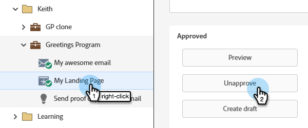

# ランディングページの承認、未承認、削除 {#approve-unapprove-or-delete-a-landing-page}

ランディングページは、承認するまでドラフトモードになります。 承認をおこなうと、残りのシステムでページを使用できるようになります。承認済みのランディングページを編集すると、Marketo Engageはドラフトを保存しますが、ドラフトを承認するまで、承認済みバージョンを引き続き使用します。

## ランディングページの承認 {#approve-a-landing-page}

1. 目的のランディングページを選択し、をクリックして **[!UICONTROL ドラフトを承認]** をクリックします。

   

   >[!TIP]
   >
   >必要に応じて、[&#x200B; 複数のページを一度に承認 &#x200B;](/help/marketo/product-docs/demand-generation/landing-pages/landing-page-actions/approve-multiple-landing-pages-at-once.md) できます。

また、左側のナビゲーションでランディングページを右クリックし、「**[!UICONTROL 承認]**」を選択することもできます。

>[!NOTE]
>
>承認済みのランディングページには、緑のチェックマークが追加されています。

## ランディングページの承認取消 {#unapprove-a-landing-page}

1. 目的のランディングページを選択し、「**[!UICONTROL 未承認]**」をクリックします。

   

左側のナビゲーションでランディングページを右クリックし、「**[!UICONTROL 未承認]**」を選択することもできます。

>[!NOTE]
>
>承認されていないランディングページは web に公開されなくなり、アクティビティは追加されません。 未承認のランディングページとその Facebook タブへの訪問者には、[&#x200B; フォールバックページ &#x200B;](/help/marketo/product-docs/administration/settings/set-a-fallback-page.md) が表示されます。

## ランディングページの削除 {#delete-a-landing-page}

1. 目的のランディングページを選択します。 **[!UICONTROL ランディングページのアクション]**&#x200B;ドロップダウンをクリックして「**[!UICONTROL 削除]**」を選択します。

   

   >[!IMPORTANT]
   >
   >承認済みのランディングページは削除できません。 まず、承認を取り消す必要があります。

また、左側のナビゲーションでランディングページを右クリックし、「**[!UICONTROL 削除]**」を選択することもできます。

## 複数のランディングページの削除 {#delete-multiple-landing-pages}

1. メインの [!UICONTROL Design Studio] 画面で、「**[!UICONTROL ランディングページ]**」をクリックします。

   

1. 目的のランディングページを選択します。 **[!UICONTROL ランディングページのアクション]**&#x200B;ドロップダウンをクリックして「**[!UICONTROL 削除]**」を選択します。

   

1. 「**[!UICONTROL 削除]**」をクリックして確定します。

   
